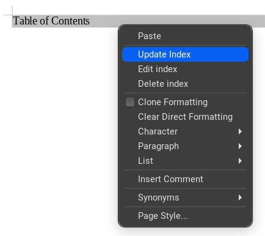
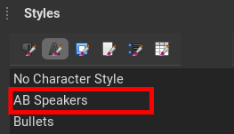

# Creating the Abstracts Booklet with CAT

The [Conference Assembly Tool](https://cat-docs.jacow.org/) has one functionality to create an abstracts booklet directly from Indico.

---

**Note**: do not confuse the abstracts generated by CAT with the Abstracts functionality in Indico. CAT's abstract booklet actually is based on ***[contributions](https://learn.getindico.io/conferences/timetable/#contributions)***, not [abstracts](https://learn.getindico.io/conferences/cfa/). Every contribution has a description which is, in fact, its abstract.

---

## Abstracts Booklet generation

The functionality of creating the abstracts booklet is available in PURR's screen of Indico and is as simple as pushing the "Download" button.

This will trigger CAT's engine which will result in a downloadable [Open Document Format text document](https://en.wikipedia.org/wiki/OpenDocument) (`.odt`).

For this to work effectively, it is important to have all contributions scheduled in sessions and session blocks.

## Settings

The resulting Abstracts Booklet will present all abstracts grouped by sessions and sort by presentation time or programme code.

It is possible to customise some parts of this document with PURR's settings:

In particular it is possible to define the structure of the two session headings by way of some variables, like `{code}`, and select which additional custom fields to include. Please refer to the [PURR's official documentation](https://purr-docs.jacow.org/Functionalities/abstractBooklet/#settings) for the details of these settings.

## The OpenDocument

The abstracts booklet will contain all abstracts from contributions scheduled in the Indico event, grouped by sessions.

Every contribution will present its programme code, title, authors list, abstract and every custom field set in PURR's settings. The presenters are highlighted in bold.

### Table of Contents

The Table of Contents is *defined* in the document but it's not *created* at the time of download. It is necessary to **force an update**. In LibreOffice it is sufficient to right-click on the "Table of Contents" paragraph and select "Update index":

LibreOffice will then create the whole ToC:

### Use of styles

The ODT is highly customisable by way of [styles](https://help.libreoffice.org/latest/en-US/text/swriter/01/05130000.html). Every piece of data in the document is set to a particular style chosen from this list (screenshot from [LibreOffice](https://www.libreoffice.org/)):

To modify its appearance it is sufficient to modify the related style. 

**Example**: let say that you want the programme code to be blue (instead of *red*) and with the font DejaVu Sans (instead of *Liberation Sans*). All is needed is to set these parameters in the *AB Heading 3* style and the whole document will reformat accordingly.

The above styles are all of type paragraph. So far CAT defines only one style of type character, the `AB Speakers` one which is applied to the name of the speakers inside the authors list:

### How to hide parts of the booklet

For big conferences like IPAC having all the default information in the Abstracts Booklet can result in a huge document (~700 pages for IPAC'23). You may want to reduce the amount of information, for example NOT publishing the content of the abstract itself. This will result in having only programme codes, title and authors list per default.

This result can be easily achieved since the ODT styles can be "hidden". In LibreOffice it is sufficient to edit the style, select the "Font Effects" tab mark the "Hidden" checkbox and confirm the window.
