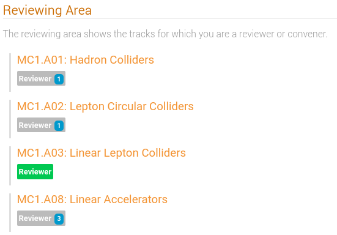
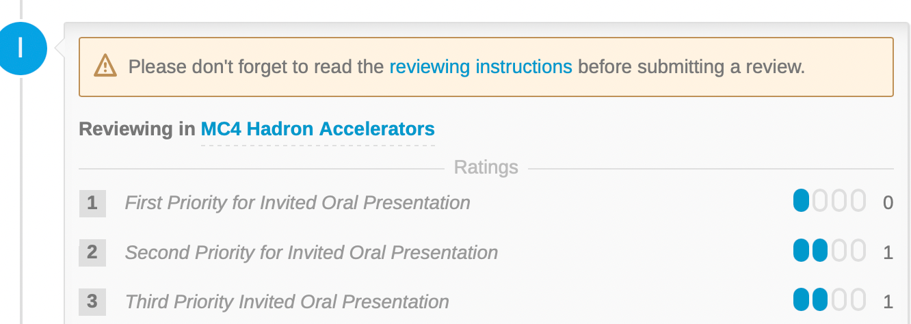

# Reviewing abstracts by the SPC (simplified workflow)

---

*This is an explanation for the Scientific Programme Committee (SPC) on how to  perform the **second step of the [Simplified workflow for selection of Contributed Abstracts](intro.md#simplified-workflow)**. SPC members will review proposed classifications for abstracts and prioritise them in one round.*

---

## The Reviewing Area

Upon logging in and clicking on the *Call for Abstracts / Reviewing Area*, all SPC Members (now having Review permissions) will see the list of Tracks, for each track the number of abstracts to be reviewed, in Green are those with no more abstracts to review:

Clicking on the track name (in blue) above brings the reviewer to the **review interface for that track** showing those "Awaiting Review".

The reviewer can **customise the list** to show more or less information, limited however to state, submitter, accepted type, submitted type:

**Attention**: SPC members should ***not review proposals which they deem are of no interest***.

## Reviewing a proposal

Clicking on the title of the abstract (in blue) brings the Reviewer to the overview of the submission showing the contribution type (*poster presentation*), the track proposed by the submitter, the authors, speakers, etc.

The SPC members at this stage are called to perform two actions:

- give priority (first/second) to abstracts they would like to propose to be considered as contributed oral presentations;

- propose a track/classification change wherever they think the proposed track is not appropriate.

These two tasks can be performed independently and are described below.

The six different cases are as follow:

1. [proposed track is appropriate, abstract to be proposed as oral presentation](#1-proposed-track-is-appropriate-abstract-to-be-proposed-as-oral-presentation): the reviewer will only assign a priority to the abstract;

2. [proposed track is **not** appropriate, abstract should be left as poster presentation](#2-proposed-track-is-not-appropriate-abstract-should-be-left-as-poster-presentation): the reviewer will only propose a track change;

3. [proposed track is **not** appropriate, abstract to be proposed as oral presentation](#3-proposed-track-is-not-appropriate-abstract-to-be-proposed-as-oral-presentation): the reviewer will assign a priority to the abstract **and** propose a track change;

4. [proposed track is appropriate, abstract should be left as poster presentation](#4-proposed-track-is-appropriate-abstract-should-be-accepted-as-poster-presentation-leaving-a-comment-optional): the reviewer leave the abstract as it is. An optional comment can be left;

5. [the abstract is not appropriate for some reasons](#5-the-abstract-is-not-appropriate-for-some-reasons): the reviewer will ask the abstract to be rejected;

6. [the abstract is a duplicate of another abstract](#6-the-abstract-is-a-duplicate-of-another-abstract): the reviewer will mark it as duplicate to merge with. This final case is rarely used in IPACs and can be ignored.

For all cases but #4 it is first needed to press the "Review" button in the interface (ignore the "*Leave a comment...*" area for now) towards the bottom of the page:

---

*SPC members should carefully read the reviewing instructions available after pressing the "Review" button before posting their review. Special requirements may be present for each specific IPAC.*

---

### 1. Proposed track is appropriate, abstract to be proposed as oral presentation

For a normal IPAC it is possible to assign a *First Priority* (i.e., "I strongly support this abstract to be accepted as contributed oral") or a *Second Priority* (i.e., "I also support this abstract to be considered as an contributed oral") to an abstract, by way of Yes/No widgets: 

---

**Note: at a typical IPAC every SPC member is allowed to cast a maximum of *five* first priorities and a maximum of *five* second priorities for each Main Classification.** If we consider that we normally have eight Main Classifications (MC1 through MC8) this will allow 80 maximum votes per SPC member (40 first and 40 second priority).

The SPC Chair, however, may choose a different number of possible votes to be cast. The Scientific Secretary will confirm and give precise instructions on how many priorities an SPC member is allowed to assign for a specific IPAC.

---

After scoring a First or Second Priority, an action must be selected from the pop-up menu:

For this particular case the right option is **Accept**, which means a suggestion for the MC Coordinator to accept this proposal as contributed oral with the selected priorities.

To complete this task please remember to click on the **Submit review** button.

### 2. Proposed track is **not** appropriate, abstract should be left as poster presentation

After having clicked on the **Review** button the screen depicted here above is presented.

Since you are **not** proposing this abstract to be selected as contributed oral, **do not** give any priority - in other words, do not press any Yes/No buttons shown.

Instead, click on the drop-down menu "**Propose an action...**" and select "**Change track**". The list of all the other possible classifications are shown, as in the example below:

After having selected the appropriate classification and, eventually, left a comment, submit your review by clicking on the "**Submit review**" button.

Note that a proposal for a change of track effectively leaves the abstract in the original "submitted" Track and proposed modifications appear to the reviewer when hovering over a contribution in the list of proposals for review:

To the other reviewers and conveners the same abstract will appear like this:

 

### 3. Proposed track is **not** appropriate, abstract to be proposed as oral presentation

This option is the natural merge of the first two above. In practice, follow all the steps described for [case #1](#1-proposed-track-is-appropriate-abstract-to-be-proposed-as-oral-presentation) but, instead of selecting "Accept" in the end, select "**Change track**". More details in [case #2](#2-proposed-track-is-not-appropriate-abstract-should-be-left-as-poster-presentation).

### 4. Proposed track is appropriate, abstract should be accepted as poster presentation: leaving a comment (optional)

In this case the SPC member should not perform any action. However, if the SPC member wishes to leave a comment (in particular for the MC Coordinator, but also for the other SPC members) they first need to click on the "*Leave a comment...*" area towards the bottom of the page:

Now a comment can be entered in the expanded area. **Be sure that the option *Visible to reviewers, conveners and judges* is selected**, otherwise the other SPC members won't be able to read it.

*Please note that non-SPC members won't be able to read comments or other reviews.*

### 5. The abstract is not appropriate for some reasons

This is very exceptional and rarely encountered. However, if for any reasons the reviewer needs to request not to accept this abstract, they can select the "**Reject**" option from the drop-down menu (after having clicked on the **Review** button).

No priorities should be given in any case.

Be sure to enter the reason for this action in the comment area, then press the "**Submit review**" button.

### 6. The abstract is a duplicate of another abstract

Also this case is very rare. If needed, select the "**Mark as duplicate**" option above and enter the abstract id in the appropriate text box (search by title available).

The last option "Merge" is identical to this "Mark as duplicate" and should not be used.

---

When the SPC members have reviewed all the proposals in the system, this exercise is completed.

---

