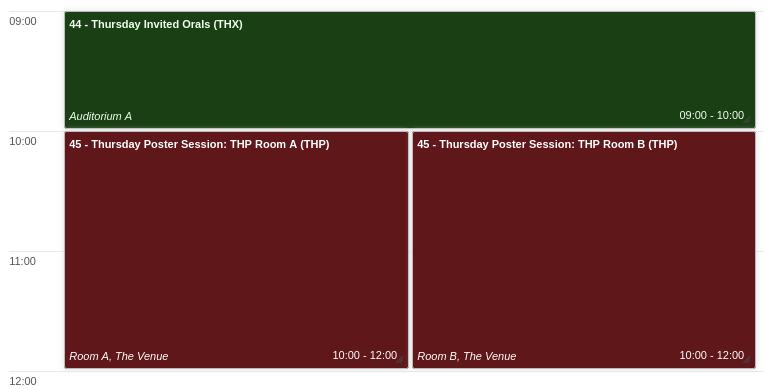

# Multiple Poster areas

So far we have considered the general rule of "only one Session Block for every Session", as described in the [how to create sessions](..//InvitedOrals/SSpcodes.md#sessions) and [how to create session blocks](../InvitedOrals/SSpcodes.md#session-blocks) instructions. 

However, this rule has some exceptions. The most common one is needed when there are** too many posters in a session to be accommodated in one area** (or room) only. This is quite typical for IPACs where the overall number of posters is in the order of the thousands.

To solve this issue we might think of two different approaches:

1. **Split the original session in multiple sessions**. This will conserve the above rule of one block per one session. At the same time, management can be cumbersome due to the fact that contributions must be manually placed in each session right from the start. The [Village System](../SSpcodes/#the-village-system) cannot be easily automatised. For this reason this method is not best overall.

2. **Use multiple session blocks for one session**. Since sessions in Indico are meant to be defined mainly according to the type of contributions to present, delegating to session blocks the task to define places and times, this approach is more adherent to Indico's structure and is the chosen one for our conferences.

## One session, multiple blocks

IPAC usually has one poster session per day (Sunday to Thursday). For this task we will use a simplified example involving ten contributions in the Thursday Poster Session (*with programme code* ***THP***). The selected venue can provide two rooms (*called* ***A*** *and* ***B***) that can accommodate only five poster boards each. The ten contributions in session THP will then be split in the two rooms by the **Change Session Block** JACoW.org utility.

Here we will go through the basic steps of the whole procedure.

### 1. Assign all contributions to the session

First you need to assign all Thursday posters in the THP session. This is usually done following the [Accepting Poster presentations](../SSPosters) instructions at abstract acceptance time.

The result will be similar to the following picture:

Please note that in this example the ten contributions are titled *Fake01...Fake10* and, obviously, are not scheduled yet and are missing programme codes. 

### 2. Create Session Blocks

From the timetable admin view, and following the [how to create session blocks](../InvitedOrals/SSpcodes.md#session-blocks) instructions, you can create two session blocks called **THP Room A** and **THP Room B**. Their programme codes are **THPA** and **THPB** respectively. Please note that Session Block names are not mandatory and used here only for the sake of clarity.

### 3. Assign all contributions to one session block

The JACoW.org **Change Session Block** utility that will be used has been designed to move contributions among session blocks. For this reason, we will start adding all posters in the session to one block. To do this you open the block details and click on "Go to session block timetable".

Then you click on the "Add poster" button and add all contributions:

### 4. Assign programme codes to this block

Now we need to create programme codes for the contributions in this first block. This will allow to have the contributions well sorted according to the Village system, before we go and split them among other blocks. Follow the instructions on how to [assign programme codes automatically](../SSpcodes/#how-to).

### 5. *Change Session Block* utility

The [Change Session Block (Poster)](https://www.jacow.org/Indico/PosterSessionBlock) utility has been designed to move the posters in excess from one block to another. You need to select:

1. the origin (source) session block: in our example this is block **THPA**;

2. the target (destination) session block: here it is block **THPB**;

3. the number of contributions to keep in the origin block (i.e., its room capacity): **5** in this example.

By pressing the **Go** button the utility will move the posters from THPA to THPB. A log is normally displayed.

### 6. Reassign programme codes to posters in the new block

The contributions moved in the step above will still keep the original programme code (THPA06 to THPA10 in our example). You have now to assign new programme codes to these contributions. To do so [repeat the step 4 above](#4-assign-programme-codes-to-this-block) but for the THPB session block.

In case more than two blocks are needed, repeat these two steps until all posters are distributed into all blocks (areas).

## Result

The result of this process can be immediately seen in the normal user's view of the timetable:

## Notes on performance

The [Change Session Block (Poster)](https://www.jacow.org/Indico/PosterSessionBlock) utility currently relies on some old Indico Timetable APIs which are far from optimised. With a large number of posters, their move among session blocks can take minutes. Please be patient and don't think the utility is not working if nothing seems happening for what may seem an eternity after pressing the "Go" button.

