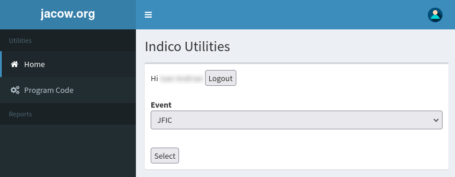

# Automatic assignment of Programme Codes

The need for Programme Codes and how to assign them has already been introduced in the [Invited Oral Presentations](../InvitedOrals/SSpcodes.md#what-are-programme-codes) section of this manual. Please refer to that page to first understand the use of programme codes in IPAC conferences.

Assigning programme codes to Contributed abstracts is an heavier task than the previous one for Invited Orals, due to their higher number. For this reason a system has been created to automatise it.

---

**Note**: these instructions can be applied to the Programme Codes assignment for Invited Oral Presentations as well. However, due to their lower number it may be easier to do it manually as already described.

---

Indico has [a system to assign programme codes from a template](../InvitedOrals/SSpcodes.md#programme-code-templates) which is not adapt to JACoW purposes. As describe before, the JACoW programme codes identify the date, the time in the day, the room and the sequential order in that session. To add to this, JACoW adopts the so called "Village System". 

## The Village System

In a JACoW conference one person can present  several posters, possibly in different classifications and, then, in different sessions. Since posters must be presented by an author, all posters in a session by the same author must be placed close to each other, otherwise it will be impossible for the presenter to stay in front of all of them. Not only, a poster could be "covered" by a co-author, luckily from the same institute, or by a colleague that presents the poster in place of the presenter who, for various reasons, could have failed to do it themselves. This is why JACoW adopts the so called "Village System":  all posters in a session are grouped by "villages" of people. In detail, the order is made grouping contributions on the following items:

1. Main Classification

2. Sub Classification

3. Country of presenter

4. Town of presenter

5. Affiliation of presenter

6. Name of presenter

Since this is a very peculiar method of programme codes assignment it is not integrated in Indico. Instead, a JACoW service has been created on the JACoW.org website.

## The JACoW utility to assign programme codes

### Prerequisites

To automatically assign programme codes with this utility it is necessary to assign programme codes to both **Sessions** and **Session Blocks**.

Since IPAC uses a mapping of one session block for each session, the codes will be identical for both. Please refer to the instructions on [how to create sessions](..//InvitedOrals/SSpcodes.md#sessions) and on [how to create session blocks](../InvitedOrals/SSpcodes.md#session-blocks) to define, respectively, the **Session Code** and the **Session Block Code** (called "Programme code" as well in the Indico screens).

---

As an example, if we expect a contribution to have a Programme Code **TUOCA01**, its Session and Session Block codes will be called **TUOCA**.

### How-to

If you haven't done this already, first schedule all your contributions to one or more session blocks in the timetable.

To do this open the block details and click on "Go to session block timetable".

Then you click on the "Add poster" button, select the contributions you want to schedule (use the "All" link to add them all) and click "Add selected":

Now we are ready to automatically assign programme codes respecting the village system.

The JACoW website offers some utilities for Indico conferences, usually provided at the address [https://www.jacow.org/Indico/Utilities](https://www.jacow.org/Indico/Utilities).

**To use them it is necessary to have Event Admin permissions on the Indico event.**

Start by opening the utilities page in a browser and by logging in: 

By clicking on the "**Log In**" link you will be presented by the Indico login. Use your JACoW account as usual to login.

Select the event you want to use these utilities from the drop-down menu (only active events for which you have admin privileges will be shown):

Now click on the "**Program Code**" menu.

The system will show all sessions defined in that event. Automatic assignment of programme codes can be done for all sessions (not recommended) or for one or more. By checking the checkbox before the session code the list of contributions in that session will be displayed. Existing codes (if any) and new (proposed) codes are visible, as shown in this figure:

Here you can see four different cases:

1. Session **TUZB** has not been selected, hence the details are hidden.

2. Session **TUOCA** has been selected for assignment. Programme codes already exist but differ from the new ones proposed by the system: the new (different) codes are highlighted in green.

3. Session **TUOCB** has been selected for assignment. No programme codes are present in the system yet, so all the new ones are highlighted in green.

4. Session **TUPP**  cannot be processed since its Session block is missing the programme code. The issue is presented with a red statement.

If the proposed codes are OK for you, scroll down the page and press the "**Update codes**" button. The previously displayed codes will be recorded in Indico.

### How to define the number of digits in the code

The system automatically selects the number of digits to use according to the number of contributions in the given Session (Block). In other words, if in session **TUOCA** there were 9 contributions, one digit will be used (*TUOCA1...TUOCA9*), if there were, e.g., 78 two digits will be needed (*TUOCA01...TUOCA78*) etc. (three digits with, say, 126 contributions: *TUOCA001...TUOCA126*, and so on).

If you want to have the same number of digits for all sessions (like, have three digits even for a session that only has 9 contributions), it is possible to "force" the system by adding a `?digits=N` parameter in the URL. For our previous example (three digits) the URL will read as [https://www.jacow.org/Indico/ProgramCode?digits=3](https://www.jacow.org/Indico/ProgramCode?digits=3)
