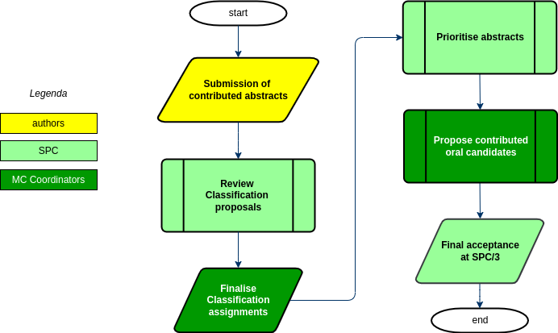

# Workflows for selection of Contributed Abstracts

## Introduction

After having [selected the Invited Orals](InvidedOrals/intro.md) authors are allowed to submit their contributed abstracts, both of Oral and Poster type. The SPC then needs to select the proposed Contributed Orals and enter them in the conference programme.

The deadline for abstract submission for the large JACoW events is generally around 5 or 6 months prior to the conference, and around 2 or 3 months prior to the
deadline for early registration.

Abstract submission may be opened several months prior to the submission deadline, but the bulk of abstracts will be submitted only in the weeks and days prior to the
deadline.

Organisers should refrain from extending the deadline in the absence of submissions a week in advance of the deadline. This causes people to stop submitting, and pick up again a couple of days before the new deadline. 

On (or a little in advance of) the deadline for abstract submission, the Admin will begin preparing the abstracts for review by the SPC (*Abstract Initial QA*). The SPC will then decide the contributed orals, the Admin will invite the speakers, and once all responses have been received, advise all other submitters that their work has been accepted for what will normally be poster presentation.

To avoid "no shows" (unsightly empty poster panels), the Admin will remind all contributors several times prior to entering programme codes that only work presented by a registered participant will be scheduled.

## Normal workflow

The usual workflow for the selection of Contributed Oral Presentations is as follow:

1. **Authors** submit their abstracts consisting of a title, a brief description of what
    the talk will cover, one or more authors and a proposed Track/Classification;
2. **SPC** members review the Track assignments of *all* proposed abstracts;
3. **MC Coordinators** accept/reject requests of classification changes from previous step;
4. **SPC** members review all proposals by assigning priorities for oral presentations selection;
5. **MC Coordinators Chairs** review the priorities given in the previous step to produce a preliminary list of preferred contributed oral presentations and reserves;
6. at the SPC/3 meeting the **SPC** reviews the proposals from the previous step, selects the final candidates, put the contributions in the Scientific Programme.

## Simplified workflow

If the time available for the SPC to perform the above tasks is limited, it may be impossible to implement them with reasonable time available to SPC members to review twice all the abstracts. Fortunately it may be simplified by merging the track change proposals and priorities assignment in one step only. The simplified process then results like this:

1. **Authors** submit their abstracts consisting of a title, a brief description of what
   the talk will cover, one or more authors and a proposed Track/Classification;
2. **SPC** members review *all* the abstracts by proposing Track changes and assigning priorities for oral presentations selection;
3. **MC Coordinators** accept/reject requests of classification changes from previous step;
4. **MC Coordinators** review the priorities given in the step #2 to produce a preliminary list of preferred contributed oral presentations and reserves;
5. at the SPC/3 meeting the **SPC** reviews the proposals from the previous step, selects the final candidates, put the contributions in the Scientific Programme.

## Instructions for the SPC

The exact instructions for the SPC are described in the dedicated pages for both the [normal workflow](SPCtrackreview.md) and the [simplified one](SPCreview-s.md). Please use the dynamic menu on the left to navigate through these instructions according to the workflow model your IPAC has chosen.
