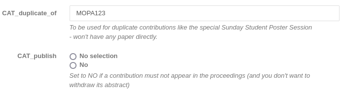

# Contributions in multiple sessions

IPAC has a long tradition of organising a Special Student Poster Session on the Sunday. This session is aimed to helping young scientists get higher visibility and benefit for their career.

The Scientific Programme Committee offers any student participating in the conference with a contribution (usually, poster) to present it twice: first in this Sunday, students-only, session, and then in a "normal" session with all the other posters.

For this purpose, an Indico contribution should be allocated into two different sessions (and then session blocks). However, this is not possible, since in Indico one contribution can only be scheduled once.

To overcome this limitation, it is possible to duplicate (clone) a contribution to a new one. The latter will then be scheduled in the Sunday Poster session.

## Editing and proceedings

In view of the proceedings, however, these two contributions should be presented in two sessions but as a unique (contribution) paper. In fact, the contribution is only one even if presented twice or more, so also the related paper should be one.

**The Editor-in Chief, then, should assure that all the "duplicated" contributions are not edited by the Proceedings Office.**

However, the contribution should be present in the proceedings in both sessions. For this reason, it is needed to keep a "link" between the two contributions in Indico. This is possible by way of a custom contribution field that will keep the "parent" code of the contribution. This custom field is usually called `CAT_duplicate_of` and can be created as all other [abstract/contribution fields](../../InitialSetup/mgmt_area_03/#configure-the-contribution-types-and-abstracts-fields). This field should be hidden to the general public ("administrator only").

### Example

Let's think that a student has submitted a contribution with programme code `MOPA123`, scheduled on the Monday's poster session. To allow this student to also present it in the Special Students Sunday Poster Session, the contribution is cloned. To the new, cloned, one is then assigned a new programme code `SUPM004`. To establish the link introduced above, the administrator should edit `SUPM004` and populate the `CAT_duplicate_of` field with `MOPA123`.

This will be used by CAT when creating the proceedings to present only one paper. See the related section in the [documentation about proceedings creation](../../Proceedings/proceedings/#notes-on-duplicate-contributions).

