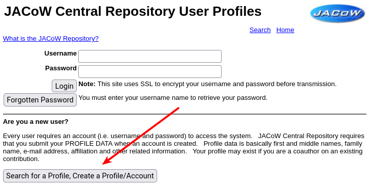
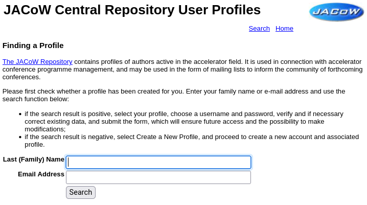
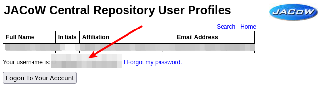

# How to login to the IPAC Indico event

## Getting to the Indico event

The address of the IPAC event you want to access is surely published on the website of the conference (usually, <https://ipacXX.org> - e.g., <https://ipac23.org>, <https://ipac24.org> etc.

The usual URL for IPAC Inidico events is <https://indico.jacow.org/e/IPACXX> (e.g., [IPAC'23](https://indico.jacow.org/e/IPAC23), [IPAC'24](https://indico.jacow.org/e/IPAC24) etc.)

## Your JACoW account

All JACoW conference are organised around the [JACoW Central Repository](https://oraweb.cern.ch/pls/jacow/profile.html) which is an enormous database of **_profiles_** (personal data including name, email and affiliation) and **_accounts_** (profiles with a username and password which allow login). Profiles are usually created by authors while submitting an abstract and adding co-authors not yet present in the Central Repository. Accounts can be created by any individual.

## Login

**To login to this special JACoW Indico installation, please be sure to use your JACoW account from the [JACoW Central Repository](https://oraweb.cern.ch/pls/jacow/profile.html), which usually is _not_ your email address.**

The address of the IPAC event you want to access is surely published on the website of the conference (usually, <https://ipacXX.org> - e.g., <https://ipac23.org>, <https://ipac24.org> etc.

The usual URL for IPAC Inidico events is <https://indico.jacow.org/e/IPACXX> (e.g., [IPAC'23](https://indico.jacow.org/e/IPAC23), [IPAC'24](https://indico.jacow.org/e/IPAC24) etc.)

In case you lost your username, please read the next section.

## How to recover your username

Open the [JACoW Central Repository login page](https://oraweb.cern.ch/pls/jacow/profile.html) and click on the "**Search for a Profile, Create a Profile/Account**" button:

Now search your name or your email address:

The system will present a list of profiles and accounts. Chose the yours and press "**Select Above**" (option **1** in the next screenshot).

Your profile will be shown with your username highlighted just below your data:

Please copy and use it to login into the IPAC Indico event (not into the Central Repository anymore!).

## How to reset your password

Open the [JACoW Central Repository login page](https://oraweb.cern.ch/pls/jacow/profile.html), enter your username and click on the "**Forgotten Password**" button:

You will receive an email with instructions on how to reset your password.

After this operation you will be able to login into the IPAC Indico event (not into the Central Repository anymore!).

In case of problems, please _contact the JACoW Repository Manager_ (exact contacts available at [JACoW / Contacts](https://www.jacow.org/Main/Contacts)).

## How to create a new JACoW account

Open the [JACoW Central Repository login page](https://oraweb.cern.ch/pls/jacow/profile.html) and click on the "**Search for a Profile, Create a Profile/Account**" button:

Since a profile for you may already exist, possibly created by a colleague when submitting an abstract for a JACoW conferece, start by searching your name or your email address:

The system will present a result page following your search. You might find directly your profile in either the exact match or close search sections of the page:

If your profile is found you can (and should!) Click the "**Select Above**"button (option **1** in the above image). You will be asked to check and complete your data and create an account with a username and password.

Otherwise, if you didn't find your profile, you should click on the "**Create a New Profile**" link (option **2** above).

You will then be presented with a form where you can input your information:

Please read all the instructions in the page on how to format your data to be added. In particular, select your affiliation from the list available in the system. Refrain from adding new affiliations whenever a similar already exists. In case of doubts, please _contact the JACoW Repository Manager_ (exact contacts available at [JACoW / Contacts](https://www.jacow.org/Main/Contacts))

Not shown in the above image is the part related to conference series you are interested: please select all the ones for which you want to receive the general announcements.

When ready, press the "**Submit**" button at the bottom of the page.

## Troubleshooting

--------------------------------------------------------------------------------

**If you cannot login to the IPAC Indico event**, please try logging in the [JACoW Central Repository](https://oraweb.cern.ch/pls/jacow/profile.html) first. If this works successfully, try logging in Indico with the same username/password. In case this won't work, contact the _Scientific Secretariat/Event Administrator_ (contacts are usually provided in the IPAC event pages) or the _JACoW Repository Manager_ (exact contacts available at [JACoW / Contacts](https://www.jacow.org/Main/Contacts).

--------------------------------------------------------------------------------
