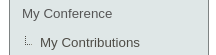
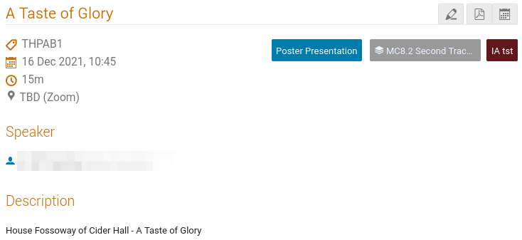
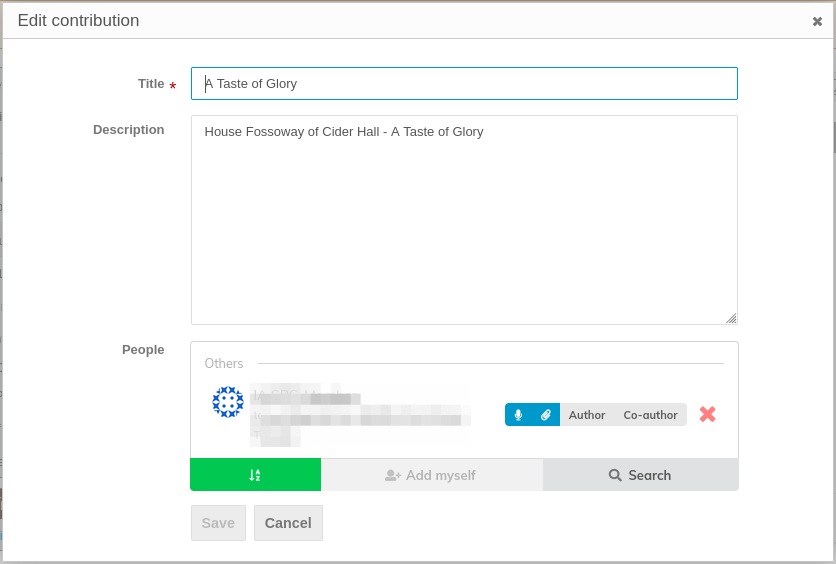

# How to edit a contribution

**Abstracts** that have been accepted by the Scientific Programme Committee become ***contributions***. These are allocated in the Scientific Programme in sessions, which means they have a room, date and time of presentation, duration and programme code.

All contributions submitted to the conference are available under the "Contribution list" menu item of Indico.

To quickly get to your contributions, which means all contributions you have submitted or are allowed to edit (because you are the speaker, for example) enter the "**My Contributions**" menu entry:

which brings to the list of your contributions. By clicking on their title you can get its details:

Please consider the three buttons on the top right. With these it is possible to:

- **edit** the contribution (pencil button)

- **export** the contribution to PDF

- **insert** the contribution **in your digital calendar** by way of a [CalDAV](http://en.wikipedia.org/wiki/CalDAV) link or [iCalendar](http://en.wikipedia.org/wiki/ICalendar) file

## Editing the contribution details

After clicking on the pencil button it is possible to edit the contribution details.

In particular:

- **Title**: this should reflect the title that will be written in the paper or the proceedings. *Title of  Oral Presentations should not be modified* without getting the permission by the Scientific Secretariat, so please check with them whenever a change is needed;

- **Description**: this is the abstract for the contribution. Please use text-only material (i.e., no MarkDown, no HTML, no LaTeX, ...) and avoid copying and pasting from word processors which could introduce badly printing symbols;

- **List of authors/speakers** (People): we recommend to use the "Author" type for the corresponding/first author and  "Co-author" for all the others. The order is not important ans since it will be adjusted automatically when creating the proceedings.

Whenever you would need to add co-authors which do not have a JACoW profile, please follow the instructions about [how to create JACoW profiles for new authors](../submission/#creating-jacow-profiles-for-new-authors)

It is also important to check who is the **speaker** (for orals) or presenter (for posters): this person needs to have the "**microphone button**" highlighted.

Those authors that will also have the "**paper clip**" button highlighted will be considered **submitters**: they will be able to modify the contribution and upload files for presentation/proceedings.
