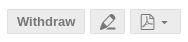
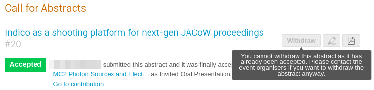
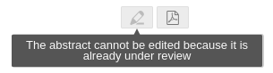

# How to edit your abstracts

## Login to the IPAC Indico event

See [How to login to the Indico event](JACoWlogin.md) for details on how to login to the IPAC Indico event.

## Editing and withdrawing an abstract

The "**Call for Abstracts**" item from the Indico menu on the left brings to the possibility of submitting new abstracts and to the list of your already submitted ones.

This screen also presents the type and status of the abstracts: in the example above abstract id `#20` has been accepted as Invited Oral Presentation, while `#85` has been submitted and is waiting for evaluation by the Scientific Programme Committee.

Until the abstracts are not accepted by the SPC it is possible to edit them by their submitters.

To do this, first **click on the abstract title** and access the abstract details. On the top right of the screen three buttons can be found. 

With these buttons it is possible, respectively, to withdraw, edit and export to PDF the abstract.

The edit button (*pencil*) brings to the same [screen of the submission](submission.md). It is possible to modify the title, abstract text, authors list, proposed track.

If the abstract has been accepted and a contribution created, the submitter cannot withdraw nor edit the abstract anymore. While **contributions can still be edited**, to withdraw an abstract it is necessary to contact the Scientific Secretariat of the conference.

Another state that will disable the editing by the submitter is while the SPC is reviewing the abstract:

For these special cases, contact the Scientific Secretariat of the conference.
