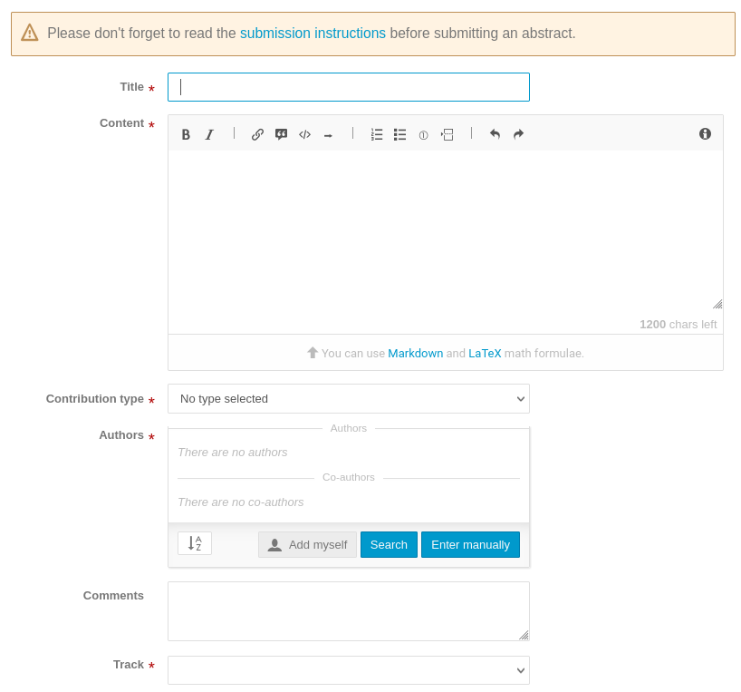
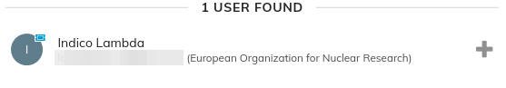
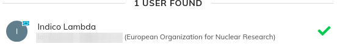
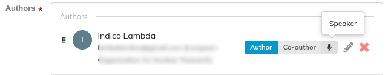
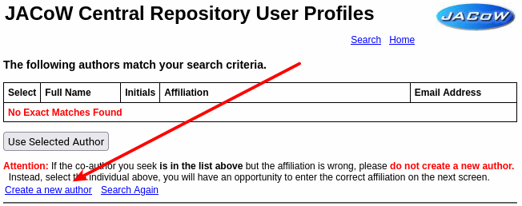
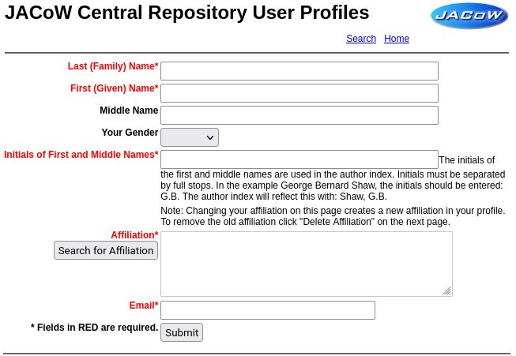
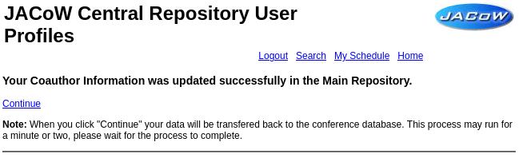

# How to submit an abstract

## Login to the IPAC Indico event

See [How to login to the Indico event](JACoWlogin.md) for details on how to login to the IPAC Indico event.

## Create a new abstract

From the event screen click *Submit new abstract* :

The abstract submission form will appear. Before continuing, please click on the **submission instructions** link and review any specific note for the given event. Every IPAC can have slightly different ways of organising abstracts, so please be aware of the specific directions available from that link.

All fields marked with a **red star** are mandatory. Below the image all needed fields are explained.

* **Title**: enter the title of the abstract using initial capital letters ("Title Caps"). For example: `This is a Paper Title in Initial Capital Letters`.

* **Content**: the description, or abstract text, is needed here. Please describe what you intend to present at this conference. A couple of notes: 
  
    * with Indico you can enrich the abstract content by using [Markdown](https://www.markdownguide.org) of [LaTeX](https://www.latex-project.org). However, we ask you to **refrain from using this feature**. For IPAC abstracts **please only use plain text**  
  
    * also **refrain from copying and pasting from word processors** like Microsoft Word or LibreOffice. Special characters like non-standard ticks (``, ´´, etc.) or the *three-dots character* (...) could get bad results when creating the final abstracts booklet. Be sure that these kind of special characters are avoided

* **Contribution Type**: choose between "Contributed Oral Presentation" (i.e.: a *talk*) or "Poster Presentation"
  

* **Authors**: enter the list of authors by clicking on the **Search** button:
  
    * search for the persons from the **JACoW Central Repository** by providing *Family name* and/or *Given (First) name* and/or *Email address* and/or *Affiliation*. Be sure that the "**Include users with no Indico account**" is selected
  
    * any found person will appear to the right. **Click on the plus sign**
      
  
    * the plus will change to a green tick 
  
    * now press the **Confirm** button. The user will be added to the list of authors: 
      
  
    * then mark the person that will present this abstract at the conference as "**Speaker**" (for posters this will be "*presenter*"). To perform this action  **click on the "*Speaker*" icon** to the right of the name
  
    * if you cannot find the right person in the Central Repository, please follow the directions in the [Creating JACoW profiles for new authors](#creating-jacow-profiles-for-new-authors) section below, then do the search again and select the newly created profile

* **Comments**: this space is for any notes to the Scientific Secretariat possibly needed for this contribution

* **Track**: select the Main and Sub Classification for this contribution
  

## Optional fields

The instructions above cover a generic IPAC. However, any specific edition can request to enter additional data by way of additional fields at the bottom of the submission form. Please refer to the particular instructions for the specific event. 

## Creating JACoW profiles for new authors

As explained in [JACoW Profiles and Accounts](JACoWlogin/#your-jacow-account) whenever you need to add a person (usually, co-author) to an abstract it is necessary to create a profile for them in the JACoW Central Repository. To do this, follow this easy steps:

1. access the [JACoW Central Repository User Profiles](https://oraweb.cern.ch/pls/jacow/profile.find_author?abs_id=1001) web page and search by way of last name or email address:
   

2. from the search results page, click on the "**Create a new author**" link towards the bottom of the page:
   

3. Enter all needed information in the New profile entry form:
   
   take particular care in selecting the right affiliation by searching with the "**Search for Affiliation**" button

4. When all the information is ready press the "**Submit**" button. You'll get a notification of the completion of the process:
   

5. Now, **do not click on "Continue"**. Instead, go back to the [search for authors in Indico](#create-a-new-abstract) above.
