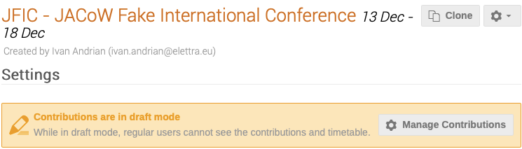

# Management Area

## Settings

The Management Area opens in the Settings screen
where the Event Administrator can customize the general
information concerning the event: the title of the event,
dates, timezone, venue, Chairpersons, Event Administrator, Keywords, etc.

Initial preparations for the conference will be made in
the JACoW-Indico event in Draft Mode, until it may be
released for the general public via the "Manage
Contributions" link shown below.

The *Manage Contributions* link leads to the
"Contributions" screen under Organization, and explained
below. This screen allows for the creation of
"contributions" outside of normal abstract submission.

Note that Indico distinguishes between "***abstracts***",
which are proposals for contributions to the conference
submitted during the call for abstracts exercise(s), and
"***contributions***" which are entries solicited by the SPC,
or entered by the Administrator, that will already have
been accepted for presentation by the SPC without going
via a review procedure (see [Glossary](../glossary.md)).    

Thus, creating entries for talks, posters etc., may be
carried out in two ways:

1. via the "usual" call for abstracts which will appear in
   the display area mentioned above when abstract
   submission is open, or

2. via the "Manage Contributions" link shown above
   when a "contribution" is created, i.e. a talk or poster
   already accepted for presentation, with no need to go
   through a selection procedure.

## Timetable

The Timetable screen is used to enter the conference
daily schedule:

Via the links to Add new Session block/Contribution/Break the Event Administrator will
build the event schedule.

## Protection

The event protection screen controls permissions/privileges to either "Manage" or "Access", parts of the event. 

When creating the event the JACoW Events Manager will have assigned the Event Administrator with full Admin permissions or privileges, together with other JACoW Experts.

Event protection ***Permissions*** are set via this screen.
Clicking on Add "User / Group" or "Event Role"
opens new windows.
Choosing between "Users" and "Groups" opens the
possibility to enter:

- **Users**: search for new Users, or choose from the
  "Suggested Users" proposed (and based on the Event
  Admin privileges) to enter individuals and enter Manage
  or Access permissions;

- **Groups**: create Group names, and either search for new
  Users, or choose from the "Suggested Users" proposed
  (and based on the Event Admin permissions) to enter
  individuals. Groups are instance-wide (indico.jacow.org),
  roles are event-only "groups".

It is also possible to assign permissions to roles that
will have been entered in the Roles Setup screen
described below.

Manage/Access permissions are thus assigned to the
different roles/users/groups.

There are three **Protection modes** for the event:

- **Public**: Publicly accessible since it is set as "open" to the
  public,

- **Inheriting**: accessible depending on the event category

- **Protected**: Only accessible by the users specified above
  and the managers of parent resources.

The ***Access key*** should **not** be used for security reasons.

The ***No access contact*** may be used to enter contact
information when a person without permissions is trying
to access the event.

The ***Visibility*** options make the event visible or invisible in the list of events in one or more categories when browsing [indico.JACoW.org](https://indico.JACoW.org). 

***Public registration*** allows users who cannot access
the event to register, i.e. exposing only a registration
form.

At the bottom of the screen the section "***Session
coordinator rights***" describes basic rights:

and offers further options which may be enabled/disabled
depending on scientific programme activities:

