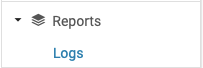

# Management Area

## Reports

### Logs

In the Management pane, under Reports/Logs is a table
from which it is possible to view or search for logs
pertaining to Emails, Events, Management, Participants
and Reviewing:

When populated it looks like this:

