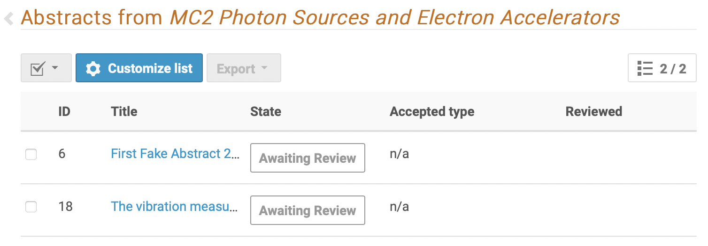
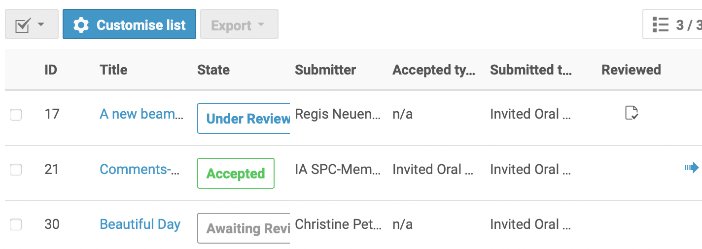
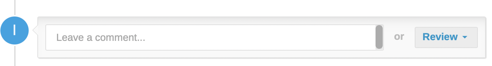
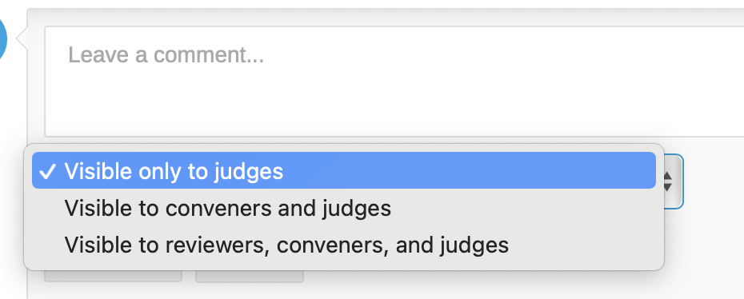
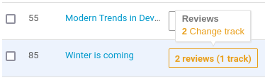

# Proposals for Track Changes by the SPC

---

*This is an explanation for the Scientific Programme Committee (SPC) on how to  perform the **second step of the [workflow for the Submission of Proposals for Invited Oral Presentations](intro.md#normal-ipac-workflow)**.*

---

## The Reviewing Area

Upon logging in and clicking on the *Call for Abstracts / Reviewing Area*, all SPC Members with (now having Review permissons) will see the list of Tracks and their permissions, for each track the number of abstracts to be reviewed, in Green are those with no abstracts to review:

Clicking on the track name (in blue) above brings the reviewer to the **review interface for that track** showing those "Awaiting Review".

The reviewer can **customize the list** to show more or less information, limited however to state, submitter, accepted type, submitted type:

**Attention**: SPC members should ***not review proposals which they deem are of no interest***.

## Reviewing a proposal

Clicking on the title of the abstract (in blue) brings the Reviewer to the overview of the submission showing the contribution type (*invited oral presentation*), the track proposed by the submitter, the authors, speakers, etc.
Towards the bottom of the page it is possible, either to *leave a comment*, or to *Review*:

### Leaving a comment

If the SPC member wishes to leave a comment they need to ensure it is *visible to reviewers, conveners and judges* first: 

Comments should be left when no explicit request to change tracks is considered needed, and they will be visible to the other SPC members (reviewers).

It will be possible to leave comments also when asking for a track change, in which case this option is not needed.

### Review the proposed track

Clicking on the **Review button** brings up the following screen with a dropdown list to propose an action such as a change of track, accept, reject, mark as duplicate or merge. 

---

*SPC members should carefully read the reviewing instructions before starting. The aim of this exercise is to check that Tracks are correct.*

---

For this stage SPC members are asked to limit themselves to the *Change track option* in this interface, and then to ""save"" it:

Please **do not accept/reject/mark as duplicate/merge during this exercise**.
Note that a proposal for a change of track effectively leaves the abstract in the original "submitted" Track and proposed modifications appear to the reviewer when hovering over a contribution in the list of proposals for review:

To the other reviewers and conveners the same abstract will appear like this:

When the SPC members have reviewed all the proposals in the system, this excercise is completed.

