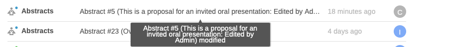

# Abstract Initial QA of proposals

Prior to handing over all proposals to the SPC to decide invited oral presentations, the Scientific Secretariat/Editor-in-Chief/Admin quality assures all proposals. In JACoW jargon this is known as Abstract Initial QA.

This job should be performed on all initial proposals, which means between steps 1 and 2 of the [IPAC workflow](intro.md#normal-ipac-workflow). It *could* be done, however, only on the abstracts having a score (i.e., between steps 4 and 5) .

The procedure of Abstract Initial QA is simply the technical editing of submissions performed by the SS/Admin/Editor-in-Chief. It consists of checking each individual submission to ensure that the formatting of the title is correct, including names of machines, etc., since this is how the title will appear in conference publications, the programme booklet, the abstracts brochure, and in the proceedings. The SS also checks there are no strange characters in the abstract text, or other problems, with footnotes for example. Abstract Initial QA is thus a form of technical editing prior to turning over the abstract to the SPC for scientific review.

The Scientific Secretariat with Event Manager/full Admin privileges, scrolls through submissions in the **Workflows / Call for Abstracts / List of abstracts / Manage** interface, where the total number of abstracts submitted is shown:

The List of Abstracts ordered by ID (in the order they were created) has a number of columns providing a wide overview:

Use the pen icon to edit.

The columns can be customized and filters applied:

To facilitate the search and filtering it may be useful to create a "hidden" field (**Workflows / Call for Abstracts / Abstract fields**, Visibility "*Only Managers*") for the abstracts called "Abstract QA" with one value **Yes**: 

Abstract submissions can be withdrawn, edited, or converted to PDF via three buttons on the top right of the abstract details.

Edits to the abstract will allow a "Save", without changing the status of the submission (abstract). A green box appears at the top of the abstract:

The Reports / Logs under Management show that an
abstract has been modified – to the right is a letter in a circle
indicating the person who made the creation/modification:

