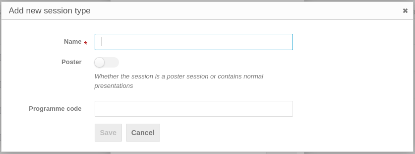
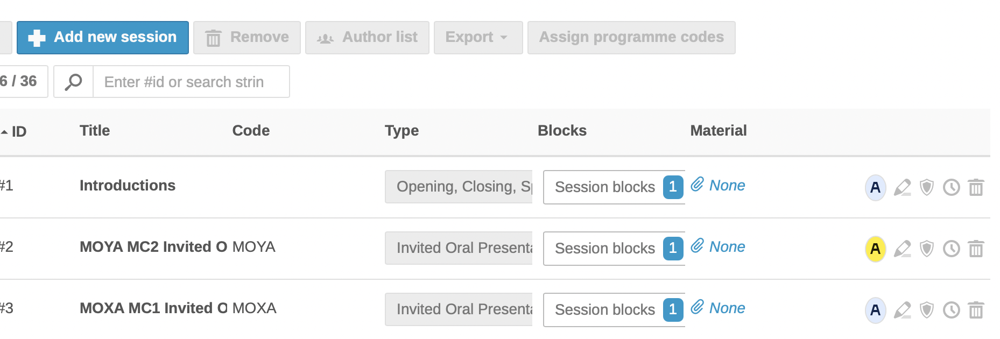
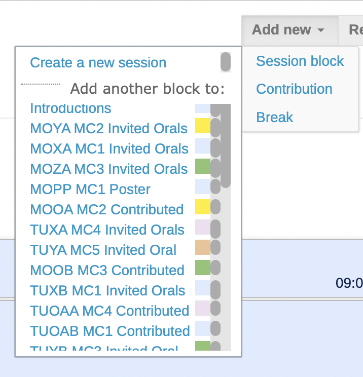
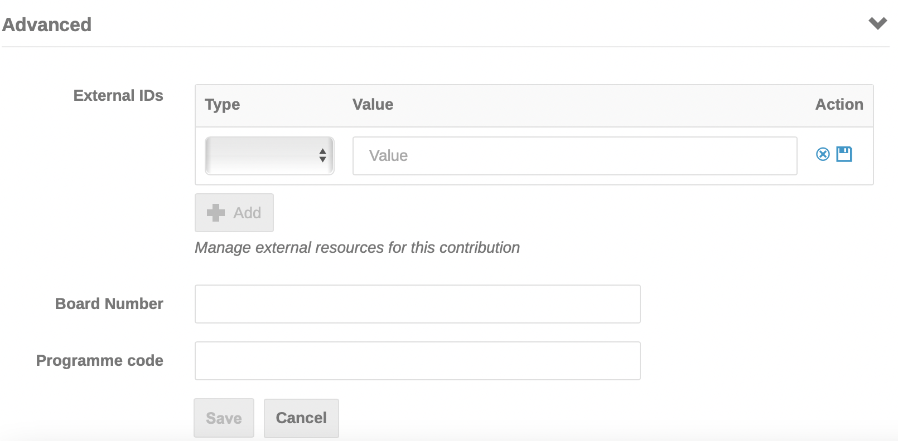
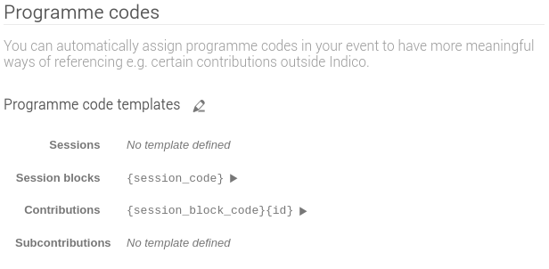

# Creating Sessions and assigning programme codes

During the SPC/2 meeting SPC members will have decided a synoptic table/overview of the week's sessions, invited orals, contributed orals and poster sessions. They will have slotted the [invited oral presentations decided at the meeting](MCCaccept.md) into invited oral sessions with talks and speakers, and will also have decided the future contributed oral and poster sessions to be populated later. 

## What are programme codes

Most JACoW conferences have protocols in place to identify contributions by a *programme code* formed of several elements. For IPAC it looks like this:

- **Date of Presentation** (**MO**, **TU**, etc.)

- **Type of Presentation** 
  
    - **X** for invited oral presentation sessions before morning coffee 
    - **Y** for invited oral presentation sessions after morning coffee
    - **Z** for invited oral presentation sessions in the afternoon
      When there are several invited oral presentation sessions in different Track Groups/Main Classifications scheduled within a block (before or after coffee, in the afternoon), use **XA**, **XB** to distinguish. 
    - **O** for contributed oral (which becomes **OA**, **OB**, **OC** if there are several contributed oral sessions during the day)
    - **P** for poster

- **A code** indicating **where** the session will take place, **A** for Auditorium A, **B** for Auditorium B, etc., or an indication of a poster session room or area

- **A digit** indicating the place within the session (001, 002, 003, etc.)

Programme codes are used as a unique identifier for a contribution scheduled in the scientific programme. The programme code has until now been used to:

- to provide when/what/where information
- to name the files uploaded for contributions to the proceedings
- for assigning DOIs

## Creating Sessions

In preparation for entering programme codes in the individual contributions, the Admin will:

1. create a Spreadsheet showing the conference programme overview of all Sessions and talks, with session and programme codes. Ensure this is correct with the SPC Chair prior to entering the programme codes since it is complicated to move contributions around once they have been scheduled.
   *Giving detailed instructions on how to manage such a spreadsheet is out of the scopes of this manual*

2. create Session Types, Sessions and Session Blocks in the Management Area. 

### Session Types

In one conference there may exist several different types of session, like:

- Opening, Closing, Special Remarks

- Invited Oral Presentations

- Contributed Oral Presentations

- Posters

- Special Student Posters

- Awards

- ...

To better classify the sessions for the conference we need to create the set of all Session Types. To do so go to **Organisation > Sessions**, then open the **Settings** popup to the right of the "*Sessions*" header. By clicking on "**Session types**" it's possible to manage existing sessions or to create new ones by way of the "*+ New session type*" blue button:

The only mandatory field here is the *name* of this session type.

Be sure, however, to switch on the **Poster flag** where appropriate.

### Sessions

---

A *Session* is a group for contributions with some attributes, like the default duration of a contribution, a type of contributions and a location. This means that you cannot mix contributions of different type (e.g., Invited Orals and Posters) in one session.

---

To create sessions for the conference go to the screen **Organisation > Sessions** and click on "**Add new session**". 

This screen has a required field for the title, and a default contribution duration. While none of the other fields are ***required*** (session code, description, type of session, location, colour), *the Session code field will identify the session in the Book of Abstracts*. Therefore, **check the default contribution duration is correct**, **ensure the type of session/presentation is correct**, and **add a location** by de-selecting "Use default" and entering a location. Continue creating the sessions for the whole conference.

---

**Hint**: *Enter the session code before the title* of the session in the title field, because the session code is not included in the session information when scheduling sessions into the session blocks. It will be easier to identify a session code rather than the title or description of the session when there may be several sessions with the same title (invited oral presentations in MC1... when there are several sessions devoted to invited orals in MC1 during the conference).

---

The sessions screen as it is populated will look like as shown below. Note the title column below begins with the session code (as hinted above) which will later therefore be visible in the Timetable when inserting talks into sessions as shown further below):

The **Block** column above will show Session blocks "0" as long as the session has not been scheduled.

### Session blocks

As seen above, a session in Indico lacks any information about "when" it will happen. For this you need to create a Session Block.

---

A *Session Block* is (one part of) a session with a date, a starting time and a duration, plus optional Conveners (chairpersons), a (possibly different) location and programme code.

Indico then permits to split one session into multiple blocks: the result is that it is possible to have different times and/or locations for a session. Normally this is *never the case for JACoW conferences*, hence **we here assume a relationship 1 to 1 between sessions and blocks**.

***For this reason one Session Block's Programme Code will be identical to its Session Code.*** 

---

To create "Blocks" you need to go to the *Timetable* screen. Select the wanted day and click on "**Add new**"... "**Session block**" to add the blocks and insert the Sessions from those previously created. Below you can see the session code entered in the session title field to facilitate identification:

You don't need to give a name to the Session Block, even more for the reason that one session will have only one block, as explained above.

However, we suggest that you fill in the **Programme Code** field when creating new blocks. Insert the corresponding **Session Code**: this will come useful when assigning Programme Codes to contributions.

---

Please note that It is also possible to create Session Blocks *and Sessions* via this interface. To do so, click on *Add new > Session block >Create a new session*.

---

The final result is visible in the Timetable:

## Scheduling contributions in the Timetable

To create the Scientific Programme in Indico means scheduling presentations in the Timetable. To do so it is necessary to go through two steps:

1. Assigning contributions to Sessions

2. Scheduling a contribution from a Session into a Session Block

### Assigning contributions to sessions

So far we have gone through the concept of Tracks, which are the scientific classification of the works. One track can then be implemented into one or more sessions. Normally, for IPACs, we keep a simple assignment of one Session (Block) per Track/Classification, but this may change whenever the organisers think of a different format.

Assigning contributions to sessions can be performed in two different ways, manually or automatically.

#### Manual assignment

*This procedure is recommended in particular for Invited Oral presentations, given the small amount of contributions to manage.*

Go to **Organization > Contributions**. Work down the list of contributions and for each one open the "**Session**" pop-up menu to select the session where the contribution will be presented. 

You may want to *filter* the contributions not yet assigned to any session.

#### Automatic assignment

*This fits better for contributed orals and posters, since at the time of opening the contributed abstracts submission the programme, hence the sessions, would be defined.*

The trick is to **modify all the tracks** and **specify a default session** for each one. Whenever an abstract will be accepted for a track, the resulting contribution will be automatically assigned to the designated session.

### Scheduling a contribution from a Session into a Session Block

To schedule the contributions in the sessions, return to the **Timetable > Blocks** screen and click on each session block and then on** Go to session block timetable**:

In the next screen click on **Add new contribution** (or ***Poster***, for poster sessions):

The contributions previously scheduled into the Sessions are shown. Select the contribution(s) and click on **Add selected**:

Once all contributions have been scheduled click within each Session block to see its contents:

## Manually assigning programme codes to contributions

To manually assign programme codes, click on each contribution and on the pen icon to edit:

Scroll down to Advanced:

Enter the full programme code.

Once the Blocks and Sessions have been created and contribution, individual programme codes entered as described above, go to Organisation / Contributions. This screen shows all of the scheduled contributions:

---

Once the Blocks and Sessions have been created and contribution, individual programme codes entered as described above, go to **Organisation > Contributions**. This screen shows all of the scheduled contributions:

*It is also possible to add programme codes via the pen icon in the individual contributions listed in this screen, which to some people may be more confortable to use than the Session Block timetable - preferences may vary.*

---

### Manual assignment of programme codes in bulk

The procedure proposed here above walks through editing every contribution and entering their individual programme codes. To speed up the process it is possible to assign programme codes to multiple contributions at once in one single screen.

To do this start from the **Organisation > Contributions** screen as above. Filter the contributions at your will, then select multiple contributions via the checkboxes to their right. It is also possible to **select all** the filtered contributions via the checkbox to the right of the "**+ New Contribution**" button:

Now press the **Assign programme codes** button to enter the multiple assignment screen:

As you can see this screen presents the "**New code**" fields pre-filled with some data and suggest to review this codes by manually editing them. This is the result of the 

***Programme Code Templates*** setting discussed below.

## Programme Code Templates

Programme codes can be generated in a semi-automatic way by using the ***Programme Code Templates*** screen reachable from the **Advanced options > Programme Codes** admin menu:

You can see that it is possible to edit four templates:

- Sessions 

- Session blocks

- Contributions

- Subcontributions

The idea here is to create a template based on placeholders like `{session_code}` or `{weekday2}`. This is explained in the Programme code templates edit screen, reachable by clicking on the pencil icon in the screen above:

What we are interested in here is the **Contributions** template. However, before getting there let's consider the Session blocks template.

When we created all the sessions we entered their session code manually. To avoid doing the same again for every session block, you can define the *Session blocks* template as `{session_code}`. Then, by clicking the **"play" icon** present to the right of the Session blocks template seen in the *Programme Code Templates* screen above, all the session blocks' programme codes will be populated by copying the code of the session they are part of.

Similarly, you may want to define the Contributions template as `{session_block_code}` at least. Remember to save these settings.

---

***Important note:*** be aware **NOT to use the "play" icon for automatic assignment of programme codes for contributions**. If used, this would remove all the already assigned programme codes and reset them according to the template, which does not contain all the necessary data IPAC conferences need. For example, with this system *it is not possible to assign a sequential ID in the programme code* - the *id* placeholder refers to the numeric abstract id and is not suitable for us.

However, this template will pre-fill the fields when manually assigning the programme codes in bulk, as presented above.

---

