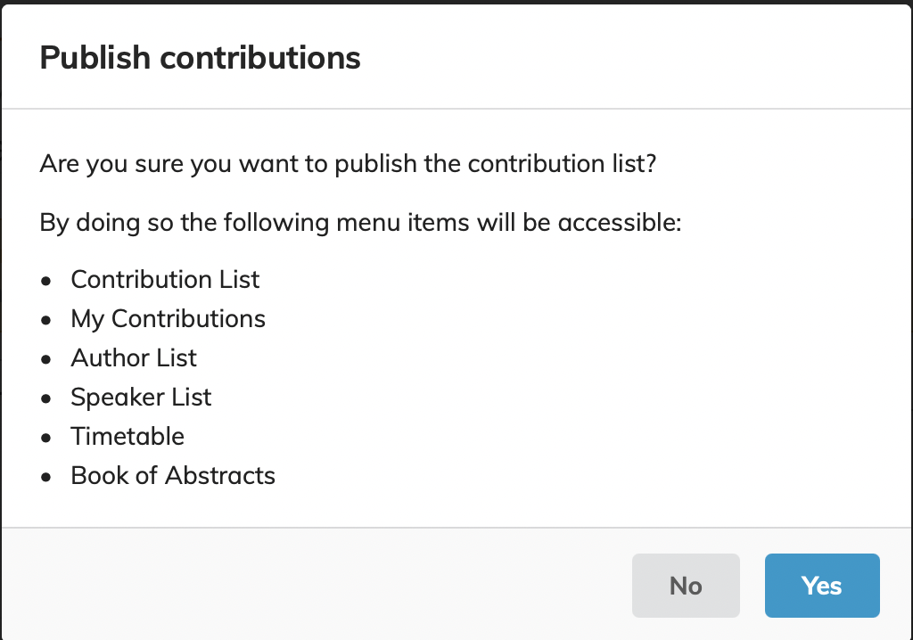
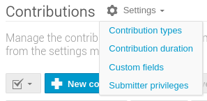

# Publishing the Programme

Until now the programme was not visible to anybody apart from the event administrators. To let it visible to the individuals having the right permissions set in the event, it is necessary to publish it.

As soon as all invited oral presentations have been scheduled, ensure the data for each presentation is correct with only ONE speaker, that both title and description are without errors, and that the durations are correctly entered for each talk.

To make all scheduled invited oral contributions visible in the display view, go to the **Management Area > Contributions** and click on "Draft" at the top right hand side of the page, then "Publish Now", and on "Yes" as shown below. 

Now switch to display view, and click on Timetable. 

## Allowing authors to modify the content of their contributions

By default Indico doesn't allow the end users (submitters) to modify the title, content and authors of a contribution as it is possible with abstracts. Only the Indico event manager can do it.

To enable authors (submitters) to modify their own contributions, go to **Management Area > Contributions > Settings** and then choose **Submitter privileges**:

Then, enable **Edit** in the popup window. Remember to save.

## Who can see the timetable now?

At this point invitations has not been sent out yet and we don't want that anybody, by logging in the event, would be able to see the programme, nor any abstract or contribution possibly under their name. This is accomplished by keeping the event protected (see the [Protection Settings page](../InitialSetup/mgmt_area_01.md#protection)): only people having explicit permissions to access the event will be able to get to this data.
