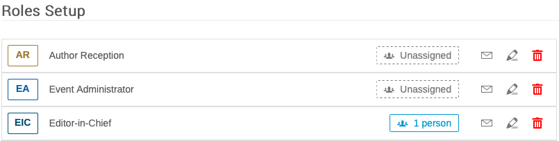
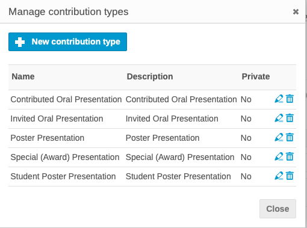
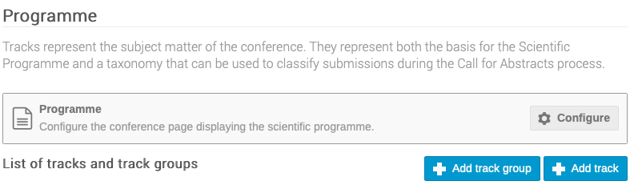
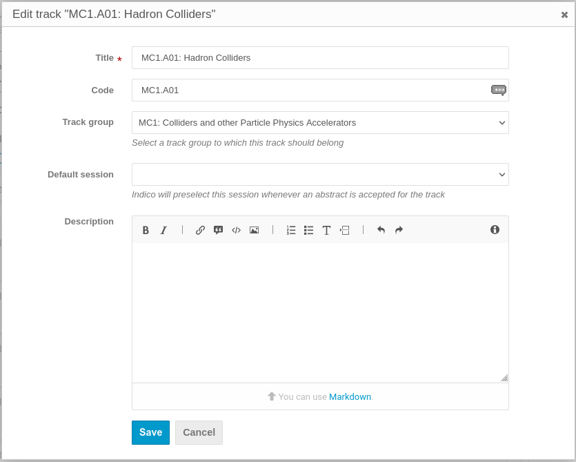

# Setting up by the Scientific Secretary/Admin/Editor-in-Chief for the submission of proposals for invited oral presentations by members of SAB/OC/SPC etc.

---

*These are the instructions for the Scientific Secretariat/Admin about how to setup Indico for the **first step of the [workflow for the Submission of Proposals for Invited Oral Presentations](intro.md#normal-ipac-workflow)**.*

---

Since Indico does not allow for several abstract submission exercises, the submission of proposals for invited oral presentations is managed outside of the general abstract submission setup.
Prior to opening for the submission of proposals for invited oral presentations it is necessary to populate several of the screens in the JACoW Indico Event:

- Organization / Roles Setup
- Organization / Contributions / Settings
- Organization / Programme
- Workflows / Call for Abstracts

Before entering this particular setup, please be sure that [manual entry of authors/speakers is disallowed](/InitialSetup/mgmt_area_02/#participant-roles). This way, authors will be forced to only use profiles from the JACoW Central Repository when submitting or editing abstracts or contributions.

## Organization / Roles Setup

The Event Administrator creates the Roles for the different actors who will participate in the organization of the conference. This is done via the Organization / Roles Setup Screen in the Management Area of the event.
The initial Roles required for the submission of proposals for invited oral presentations will normally be the OC/SPC/SAB. The following non-exhaustive list gives an idea of which Roles will be entered as the organization of the event advances:

- LOC/SPC/OC Chair

- LOC/SPC/OC Member

- SAB Member

- Scientific Secretariat

- Editor-in-Chief

- IT Manager

- Industrial Exhibition Manager

- Registration Manager

- Author Reception

- Proceedings Office Editor

- QA Editor

- Transparency Processing Editor

Indico automatically creates Speaker, Author, Co-author, Reviewer, Convener and Participant roles, etc. as abstracts/contributions are created and reviewed, and delegates register to attend.

Indico is a multipurpose generic tool. It is necessary to customise widely. For instance, Indico allows several speakers/submitters per contribution. It is necessary to ensure that the Speakers interface reflects the needs of the particular conference. Note that "Authors" are generally the primary/submitting authors and speakers with permissions concerning upload of material. Co-authors normally have no permissions except to see the contribution when logging into Indico.

To enter Roles, click on the **+ Add Role** icon and enter the roles with codes. They can be colour coded.

Against each Role the Conference Administrator will enter the names of the persons in each role. Click on the outlined box and **+ Add User** to search for the persons concerned. All persons entered via this screen are visible in the Organization / Participant Roles screen. This screen is discussed later.

To send one e-mail to several roles, use the Organization / Participant Roles interface.
An e-mail archive is to be found in the Management Area under Reports / Logs.

The Roles Setup screen thus allows the Event Administrator to create the roles, and enter the names of the persons in those roles.

### Important notes on Permissions

At this stage we are preparing for submission of proposals for invited  oral presentations: this means that the numer of people that need access to the Indico event is relatively small. *Only the Scientific Secretariat, the Organising Committee, the Scientific Programme Committee and the Scientific Advisory Board need to login and operate in this event*. 
In other words, you don't want any free access to the event details.

For this reason, we recommend that you [set the event as **Protected** under the **Protection section** of the Admin interface](../InitialSetup/mgmt_area_01.md#protection). You also want to add **Access Permissions** to the Roles created above, otherwise they won't be able to login and submit proposals.

*This settting will also prevent proposed authors for inadvertently discover their names in any submitted abstract before time in case they logged in to this event.*

## Organization / Contributions / Settings

For the submission of proposals for invited oral presentations it is necessary to set the type of contribution that will appear for selection in the Abstract Submission Form. To create Contribution types, click on the Contributions, and then the Settings link:

Click on Contribution types and **+ New contribution type** to enter them. 

The Add new contribution type screen allows to enter the Name of the type, and a description. The new contribution type can be set to "**Private**" so it* can not be chosen by users submitting an abstract*:

In the example below are the most usual contribution types. Once entered one can "Manage contribution types". They can be modified, made private, public, or deleted.

In connection with the submission of proposals for invited oral proposals, those making proposals should see only the contribution type "Invited Oral Presentation". To achieve this **ensure that all except Invited Oral Presentation are Private**.

Via the Contributions screen it is also possible to create contributions, i.e. presentations that are submitted outside of the general submission procedure, where no review procedure/acceptance is required. An example might be opening or closing remarks, etc.

For the submission of invited oral presentations, click on the pen icon for Invited Oral Presentation and in the Edit contribution type screen ensure the radio button is unchecked. If it is active, the contribution type will not be visible to submitters:

All other contribution types should remain Private.

The Manage Screen now shows the Invited Oral Presentation type is not private:

## Organization / Programme

This screen allows the entry of Track Groups (known in SPMS as Main Classifications) and Tracks (known in SPMS as Sub-classifications). 

For the submission of proposals for invited orals, only **Track *Groups*** are normally offered to submitters to facilitate rapid creation of proposals. However, since Indico normally works on the basis of Tracks, and review is via Tracks, and there is no combination of Track Group/Track as known in SPMS, it is simpler to enter the Track Groups (Main Classification) in the Tracks fields. SPC members will then see something like this when submitting proposals:

Note that when it will be time for general abstract submission it will be necessary to re-work the Track Groups/Tracks to propose a more refined grouping. The combination of Track Groups and Tracks (in SPMS Main and Sub-classifications) makes it far easier for submitters to decide the precise place their contribution should appear in the programme, and for the Event Administrator to schedule them.

**Note**: while only the *Title* field is mandatory it is useful to put the short code of the track in the *Code* field to make reports and exports more easily readable

## Workflows / Call for Abstracts

First of all this module needs to be enable by clicking the "**Enable module**" button.

The submission form is configured via the link to **Submission / Settings**.

Click on Fields and types to configure contribution types and abstract fields. 

### Submission / Settings

#### Announcement

In the field "Announcement" it is possible to enter a statement concerning abstract submission. This appears in the link to Call for Abstracts in the Home Page Menu, above the link to Submit New Abstract:

#### Multiple Tracks

While Indico offers the possibility for submitters to select several tracks, this possibility was dropped by most JACoW events many years ago with the introduction of the combination of Track Group/Track, which provides the fine tuning necessary for optimum scheduling of contributions within the programme. ***This option should NOT be set***.

#### Require tracks

IPAC proposals for invited oral presentations are normally submitted with only the Track Group (Main Classification) option to simplify the job for the proposers. Since only Tracks, and not Track Groups, may be selected in Indico (even if they are associated with a Track Group), it is necessary to imagine a workaround for the submission of proposals for invited oral presentations. 

It is thus proposed to enter the Track Groups (Main Classifications) in the Tracks (Sub-classifications) table, such that proposers see only the Track Groups (Main Classifications). As mentioned above, the Track Groups entered in the Tracks fields will need to be re-worked following the exercise of selecting the invited oral presentations, prior to opening for general abstract submission.

***This option should be set.***

#### Require contribution type

For the submission of proposals for invited oral presentations, ***this button should be set*** to Require a contribution type. As explained above, the only one visible will be *Invited Oral Presentation*.

#### Allow attachments

JACoW events do not normally allow attachments at the level of abstract submission. ***Leave this option unset***.

#### Allow speakers

In the exercise of proposing invited oral presentations, the submitter should NOT be the speaker, whereas in normal abstract submission the abstract submitter would be the speaker/primary author by default, and be able to identify an alternative speaker/primary author as well as co-authors.

The Event Administrator should thus explain clearly to proposers how to enter speakers when submitting proposals.

***This option should be set.***

#### Require a speaker

This parameter makes the entry of at least one speaker a required field.

For proposals for invited oral presentations submitters may normally enter a number of possible speakers. In the general abstract submission/call for abstracts, the primary author should by default be the Speaker/Presenter.

***This option should be set***.

#### Allow editing

For the submission of proposals for invited orals, leave the default "Abstract submitter only".

#### Contribution submitters

The text states: *Specify who will get contribution submission rights once an abstract has been accepted, and the choice of Speakers or Speakers and Authors.* It is necessary to recall that in Indico, an Abstract becomes a Contribution once it has been approved for presentation.

We suggest to choose "*Speakers and authors*". 

#### Authorized submitters

For the submission of proposals for invited orals, and the need to work outside of the normal abstract submission procedure, *enter here the names of all of the persons who are "Authorized Submitters"* of proposals for invited oral presentations. **Click on Event Role and add SPC Member, OC Member, SAB etc.**, or click on User to search and enter persons without a specific role. These persons will see the possibility to submit abstracts in the event home page even if the general abstract submission is closed.

#### Instructions

The instructions here will be displayed above the abstract submission form. It should be used for precise instructions, for example concerning the Footnotes field. At the level of proposals for invited orals it might be used for more precise instructions to the submitters, for example concerning how to enter proposals for speakers.

### Fields and types / Contribution Types - Abstract Fields

Contribution types may be entered via this interface, or via the Organization / Contributions screen, as per [instructions above](#organization-contributions-settings).

Extra fields for the abstract submission form may be created via the Abstract Fields interface if they are not included in the "default" list. Possible extra fields could be "**Footnotes**", which are used for references to other work, or keywords. To order fields, drag them by the three vertical dots handle to their left. These extra fields appear at the bottom of the abstract submission form.
