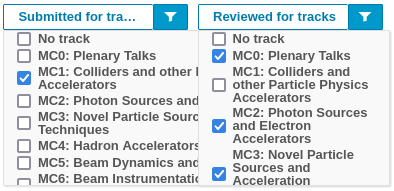

# Tips and tricks

## 1. Get a spreadsheet summary of reviews

The Scientific Secretariat/Admin can export an extended spreadsheet with averages of scores and counts of yes/no review questions. This is particularly useful for the MC Coordinators after the [SPC prioritisation excercise](SPCprioritization.md).

1. From the *Workflows > Call for Abstracts > List of Abstracts: Manage*,  filter all the submitted abstracts according to their type (e.g., *Invited Oral*) and/or Main Classification (to get only abstracts for one MC Coordinator) 
2. select all the (filtered) abstracts by way of the "All" checkbox top left of the list 
3. use the **Extended Export** button to export to an `XSLX` file.

### Syntax of the Extended Export `XSLX` file

The **Extended Export** permits to access the abstracts data in `CVS`/`XSLX` (Microsoft Excel XML) format. The columns shown in the list of abstract page, plus the various questions, are exported. The exact data exported for the questions varies according to the type of the question itself.

#### "Yes/No" question type

For every abstract, and for every Yes/No question, three columns are created, according to the possible values: Yes/No/Null. The third is possible whenever the question is not mandatory and it's not answered by somebody that reviewed this abstract. The columns are called, respectively:

- **Question *name of question* (True)**

- **Question *name of question* (False)**

- **Question *name of question* (Null)**

#### "Rating" question type

Whenever there is one or more questions of type "Rating" the export will contain the following columns:

- **Score**: the average of *all the scores* cast* for all the questions* of type "Rating" (the same value shown on the Indico abstracts web page.

- **Question *name of question* (total count)**: number of votes given to this abstract for this question

- **Question *name of question* (AVG score)**: average of the votes given to this abstract for this question

- **Question *name of question* (STD deviation)**: standard deviation of the votes given to this abstract for this question

## 2. Statistics of abstracts in tracks/MCs

### Number of abstracts originally submitted for a track/MC

1. From the *Workflows > Call for Abstracts > List of Abstracts: Manage*,  filter all the submitted abstracts selecting only one track/MC by way of the "*Submitted for tracks*" button/filter

2. read the number of the display abstracts (e.g., "*Filtering is enabled. Displaying 44 out of 492 abstracts.*")

3. repeat for all tracks/MCs.

### Number of abstracts moved away from the original track

Similarly to the previous exercise:

1. From the *Workflows > Call for Abstracts > List of Abstracts: Manage*, filter all the submitted abstracts selecting only one track/MC by way of the "*Submitted for tracks*" button/filter, plus **all the other tracks but this in "*Reviewed for tracks*"** 

2. read the number of the display abstracts (e.g., "*Filtering is enabled. Displaying 3 out of 492 abstracts.*")

3. repeat for all tracks/MCs.

### Final number of proposals

Similarly to the "Number of abstracts originally submitted for a track/MC" section, but considering only the "Reviewed for tracks" filter:

1. From the *Workflows > Call for Abstracts > List of Abstracts: Manage*, filter all the submitted abstracts selecting only one track/MC by way of the "*Reviewed for tracks*" button/filter

2. read the number of the display abstracts (e.g., "*Filtering is enabled. Displaying 45 out of 492 abstracts.*")

3. repeat for all tracks/MCs.

## 3. Count of first/second priorities by SPC members

This exercise is a little bit trickier since the Extended Export is not sufficient. 
To this purpose, we need to count all the "yes" to a question (e.g., *First priority*) a member of the SPC gave to the abstracts.

We will use the **JSON export converted to a spreadsheet**.

---

To make this exercise even more difficult, **questions in the JSON export are only referred to by their numerical ID**, which is NOT readable by the Indico interface. To discover which ID relates to which question, it is sufficient to compare the JSON export of only one abstract with its reviews from the admin interface.

For **example**, let's consider that Alice reviewed an abstract for first priority, while Bob reviewed the same abstract for second priority. The portion of the exported JSON will look like this (simplified):

```json
      "reviews": [
        {
          "ratings": [
            {
              "question": 21,
              "value": true
            },
            {
              "question": 22,
              "value": null
            }
          ],
          "user": {
            "first_name": "Alice",
          }
        },
        {
          "ratings": [
            {
              "question": 21,
              "value": null
            },
            {
              "question": 22,
              "value": true
            }
          ],
          "user": {
            "first_name": "Bob",
          }
        }
      ]
```

It's quite easy to say that the question "First priority" has ID #21, while "Second priority" #22.

---

### Step #1 - export to JSON

1. From the *Workflows > Call for Abstracts > List of Abstracts: Manage*,  filter all the submitted abstracts according to their type (e.g., *Invited Oral*)
2. select all the (filtered) abstracts by way of the "All" checkbox top left of the list 
3. use the **Export** button to export them to a `JSON` file.

### Step #2 - convert JSON to XSLX

For this step there are many ways, from writing your own scripts to [several online services](https://geekflare.com/json-to-excel-conversion/)).

We will use the free online tool [JSON to Excel Converter](https://conversiontools.io/convert/json-to-excel).

1. open a web browser at the address [https://conversiontools.io/convert/json-to-excel](https://conversiontools.io/convert/json-to-excel)

2. follow the steps to upload the JSON and get the XLSX: )

3. save the file onto your computer.

### Step #3 - fill the empty cells with values

By opening the created XSLX file with Excel or LibreOffice Calc, you'll notice that there are many empty cells. For every abstracts, all reviews are reported without repeating the previous value (i.e., abstract ID, title, name of reviewer...).

We need to fill *all* cells at least for the columns:

- **question** (ID)

- **full_name** (of the reviewer)

To do this there are several ways, we recommend two (one for Excel and one for Calc).

#### Microsoft Excel

1. Select range with non-empty cells and empty cells.

2. Press `Ctrl` and `G`, open `Go To` > choose `Special` > `Blanks` > `OK`.  

3. Enter a reference to the the name of the previous cell in the first blank cell (e.g., `=A4`).

4. Press `Ctrl` and `Enter`.

Source: [https://docs.microsoft.com/en-us/answers/questions/55208/fill-empty-cells-with-the-previous-value.html](https://docs.microsoft.com/en-us/answers/questions/55208/fill-empty-cells-with-the-previous-value.html)
or
[https://www.wikihow.com/Fill-Blank-Cells-in-Excel](https://www.wikihow.com/Fill-Blank-Cells-in-Excel)]

#### Libreoffice Calc

1. Create a column with a formula in each cell referencing the cell above (like, in `D2`, enter `=D1`, then copy `D2` onto all the cells below)

2. Select the whole column created in point 1.

3. Do a **Paste Special** (`Ctrl+Shift+V`) > "Skip Empty Cells" onto the column you want to fill.


Source: [https://ask.libreoffice.org/t/solved-fill-blank-cells-with-value-from-above/55077](https://ask.libreoffice.org/t/solved-fill-blank-cells-with-value-from-above/55077)

### Step #4 - filter the values to get the numbers

Apply an **Autofilter** to the table, then filter by **question** (`=<number>`), **value** (`=true`) and **full_name** (=`Alice`).

Excel/Calc will tell you how many rows have been selected.

Repeat for every question/SPC member.
