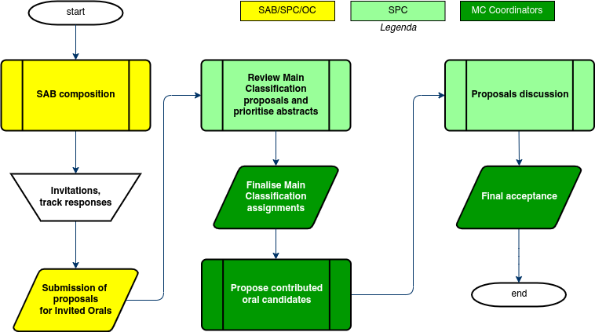

# Submission of Proposals for Invited Oral Presentations

## Introduction

Conference programmes are generally composed of three types of presentation: *Invited Oral*, *Contributed Oral* and *Poster*. The ratio of the invited orals vs. contributed orals is decided by the Committee responsible for the scientific programme (for IPAC: SPC, for HB: IOC, etc.).

For IPAC, and several other JACoW conference series, there is a ***call  for proposals for invited oral presentations approx. 15 months prior to the conference*** – the aim being to have ***a complete programme of invited orals***, the backbone of the conference programme, when the conference website goes online around ***9 or 10 months in advance of the event.***

The persons contacted for proposals are normally members of the **Organizing Committee** (OC), the **Scientific Programme Committee** (SPC), and the **Scientific Advisory Board** (SAB), though persons outside of these bodies may also be called upon to submit. All of them need to have JACOW  profiles and must have the necessary privileges. 
The **number of persons** concerned for IPAC is in the region of **120**. The **number of proposals** averages around **400**. 

It is wise to invite speakers **a year in advance** since many have full agendas.

The IPAC SPC normally meets at the so called **SPC/2** meeting just over a year in advance of the conference to decide the look and feel of the event, the overall schedule, and the invited orals (ensuring swift invitations). The Track Groups and Tracks (Main and Sub-classifications) are generally also reviewed at this meeting.

## Normal IPAC workflow

The IPAC workflow of the submission of proposals for Invited Oral Presentations is as follows:

1. **SAB/OC/SPC** members enter proposals into Indico via their own profiles. Proposals consist of a title, a brief description of what the talk should cover, one or more candidates as proposed speakers and a Main Classification;
2. **SPC** members review the Main Classification assignments of *all* proposed abstracts;
3. **SPC MC Coordinators** accept/reject requests of classification changes from previous step;
4. **SPC** members review all proposals by assigning priorities/scores prior to the SPC/2 meeting;
5. **SPC MC Coordinators** confer with their "shadows" or "deputies" to tag their priorities (1, 2nd etc.) to produce a preliminary list of preferred invited oral presentations and reserves;
6. at the SPC/2 meeting, the **Session Coordinators** announce their proposals (talks and schedule within the synoptic table) to the full SPC for discussion, with the aim to ultimately ensure the best possible overall programme, eliminating overlap in content, avoiding clashes, ensuring good geographical and gender balance.

## Simplified workflow

If the time available for the SPC to perform the above tasks is limited, it may be impossible to implement them with reasonable time available to SPC members to review twice all the proposals. Fortunately it may be simplified by merging the track change proposals and priorities assignment in one step only. The simplified process then results like this:

1. **SAB/OC/SPC** members enter proposals into Indico via their own profiles. Proposals consist of a title, a brief description of what  the talk should cover, one or more candidates as proposed speakers and a Main Classification;
2. **SPC** members review the Main Classification assignments of *all* proposed abstracts and assign priorities/scores prior to the SPC/2 meeting;
3. **MC Coordinators** accept/reject requests of classification changes from previous step;
4. **MC Coordinators** review the priorities given in the step #2 to produce a preliminary list of preferred contributed oral presentations and reserves;
5. at the SPC/2 meeting, the **Session Coordinators** announce their proposals (talks and schedule within the synoptic table) to the full SPC for discussion, with the aim to ultimately ensure the best possible overall programme, eliminating overlap in content, avoiding clashes, ensuring good geographical and gender balance.

