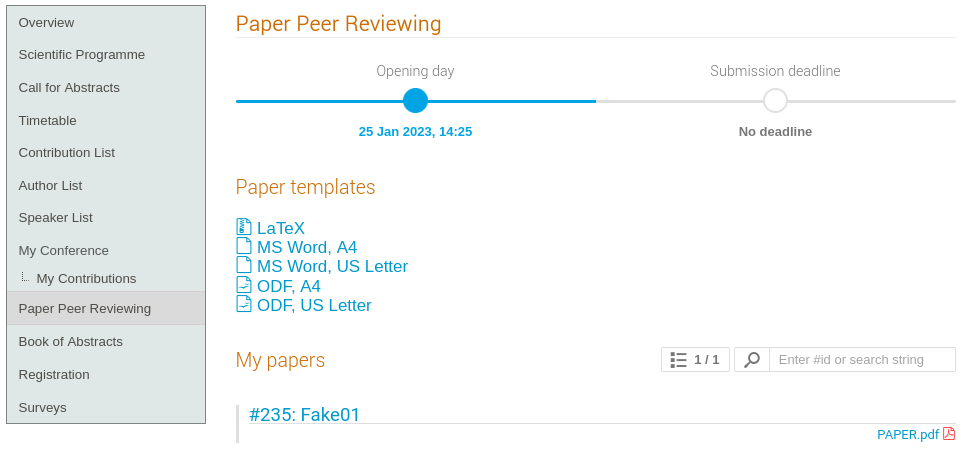

# Submission of a LPR paper

## Paper submission: the "My Contributions" area

The explanations in this section supposes that you, as an author, have already submitted an abstract to the conference and that your abstract has been accepted. In this case you will see an additional menu item on the Indico page of the conference called “My Contributions” under the “My Conference” section.

By clicking on the title of contribution (#2 in the above screenshot) you will be able to get all of its details.

Normally general and LPR IPAC submissions open at the same time. Hence, towards the bottom of the contribution's page you will see two "Submit paper" buttons. 

---

**Note**: if you are not interested in submitting your paper for LPR please follow the instructions available for the [general submission of papers](submit.md).

---

Please note that here we are interested only in the first one, **under the "Peer reviewing"** section title. The **Editing** button will be used only after the LPR process.

Now press the "Submit paper" on the top. You'll be presented with a file upload window:

Drag the file into the rectangle or click on "Choose from your computer" button, then "Save".

---

**Note:** be sure that the filename follows the normal IPAC syntax: `PAPER_CODE.PDF`

*We recommend that both PDF and source files are uploaded, even if the system does not enforce any particular file type.*

---

After the file has been uploaded you will be able to access the details of the Light Peer Reviewing process for this paper:

At this stage the IPAC LPR manager together with the reviewers assigned to your paper have been notified via email of your submission.

Whenever the LPR manager will accept, reject or ask for modifications for this paper, you will receive an email by the system. All the details of this actions will be reported in this dashboard.

*Please note that the "Submit for Editing" button to the right of the "Peer Reviewing" section header is now disabled. It will be enabled whenever your paper will be accepted by the LPR manager.*

## The Paper Peer Reviewing section

You can get back to the dashboard of any of your papers submitted for LPR from the Paper Peer Reviewing menu on the left of the Indico page:

This section can optionally present the templates to be used to write your paper (refer to the official IPAC website for more details). The "My papers" section reports the list of your papers submitted for LPR - click on its title to access the LPR dashboard presented here above.
