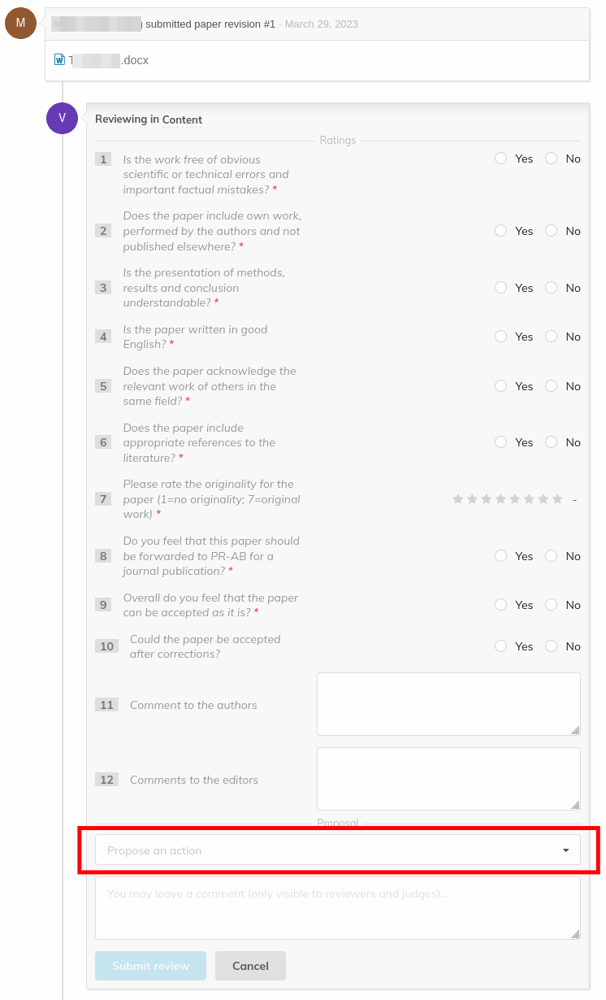

# Light Peer Review: tasks for the reviewer

As a reviewer, your job is to review the submitted papers and to propose an action - to _accept_, _reject_ or _correct_ the paper. The LPR manager will act as Judge, taking your feedback into account when deciding what to do.

You can only review papers that have been assigned to you specifically by the LPR manager.

You can see the papers in the _Reviewing area_ of the event under _Papers to review_. The papers that you have already reviewed will appear under _Reviewed papers_.

---

**Note**: Indico operates a *blind review*: the authors won't know who the reviewers are nor their proposals to the LPR manager. They will only see the LPR manager decisions, in their paper's timeline.

**Please refrain to only leave comments without actually reviewing the paper, otherwise authors and reviewers will be able to read your name together with the comment.**

---

IPAC LPR only deals with the content of the paper. The layout, or *paper editing*, will be reviewed by the JACoW team in the Proceedings Office. The LPR manager will distribute the exact rules for an homogeneous review among all the reviewers.

To review a paper, first select one paper from the list of papers to open its timeline. At the top of timeline page, you can download the latest version of the submitted paper. 

Once you have read the paper and are ready to add a review, click on _Review_.

You are asked to answer all the questions under the "_Reviewing in Content_" heading. This could be open or closed questions as well as scores to assign. Please refer to the exact instructions by the LPR manager for more information on this step.

After having completed the review survey above, you need to choose a proposed action - to _accept_, _reject_ or _request corrections_ to the paper.

Don't worry, **your action won't be immediately notified to the author**. Instead, only the LPR manager, acting as Judge, will know about it and get to a final decision at due time.

You can edit your review later as long as there is no judgement yet. This can be done by clicking the edit icon on your review.

---

In principle you could also comment on a paper without leaving a review. However, we discourage this opportunity since your comments, together with your name, will be visible to the other reviewers. IPAC LPR normally implements a blind review even among the reviewers.

If the LPR manager requests corrections, reviewers will be able to review the corrected paper after the author will have uploaded a new version of the files.

