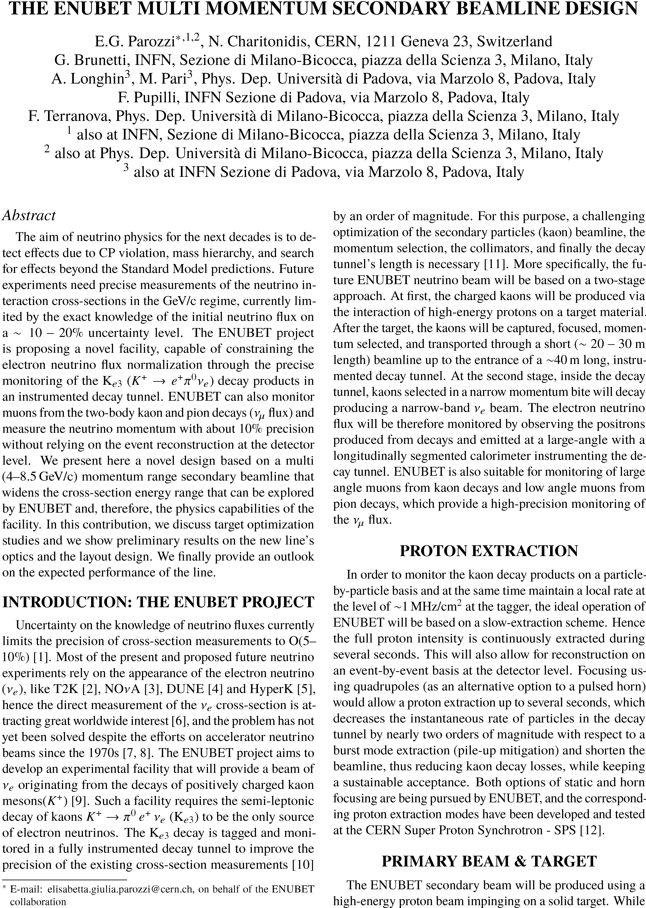

# Writing a JACoW paper: hints and reminders

## Affiliation block, titles and section headings

- Formatting the author-affiliation block:
  There are two ways to group authors and institutes, only the first one is documented in the JACoW template (this is due to only one institute per author therefore no mixture between authors and institutes which need cross references):
  
    - *by institutes*: all authors of the same institute are grouped, the main author starts, further institutes are listed in alphabetical order:

---

---

- *by authors*: the authors are listed in alphabetical order and carry a superscript number to refer to the institute, which is listed below the authors:

---

---

In the "by authors" version we need 6 lines, in the "by institutes" version 8 lines. In addition we lose 4 lines of text on the page. The reason for allowing the "by authors" version is that the number of groupings becomes confusing when there are many authors at several institutes. Using superscripts we have to list 5 institutes, in the “by institutes” version 8 institutes are listed, of which 3 appear twice.

The other advantage of the "by authors"" version is that you can more easily group a big number of authors alphabetically.

- Please ensure that all units with mixed case (**keV**, **MeV**, **GHz**, **µs**, …) are written correctly.

- The same is true for acronyms like (**SwissFEL**, **g-2**, **SuperKEKB**, **e-BEAM**, **IsoDAR**, **ThomX**, **LhARA**, **XiPAF**, **IoT**, **FCC-hh**, **HiSOR**, ...). If unsure whether it is a mixed-case acronym, check the paper how it is written when no automatic uppercasing is in effect.

- The plural of proper nouns and acronyms in uppercase has to be a LOWERCASE "s" (LINACs, PLMs, …).

- Line breaks in author-affiliation block: if author list and institute has a line break, place the institute on a line by its own (in this case the last author is not separated from the institute by a comma)

- Line breaks in title and section headings:
  
    - do not let a single word stand on a line,
  
    - try to break lines by meaning or context,
  
    - do not hyphenate words.

## Formatting references

- If a **DOI for a JACoW conference** is present, the entry "paper xyz..." should/could be removed

- the **DOI is typeset as** (example with JACoW)
  
    - `doi:10.18429/JACoW-<conference>-<paper>`
      
      **never** as a URL like
  
    - `https://doi.org/10.18429/JACoW-<conference>-<paper>`

- If a **DOI ends up in a new line** because it cannot be hyphenated and the previous line is spread due to justification, introduce a hard linebreak at the end of the text before the DOI. 

- Funny rules about **author names in references** according to IEEE style:
  
    - "first name initial" (+ middle initials) "last name" &rarr; only this sequence
  
    - "one author + *et al.*," &rarr; **no comma** before "*et al.*" 
  
    - "first author and second author" &rarr; "and", **no comma**
      before "and" 
  
    - "first author, second author, and third author," &rarr; ", and" **with** comma before last author
  
    - "first author, second author, *et al.*," &rarr; **comma** before "*et al.*" only if more than one name

## DOIs for arXiv

- In general, arXiv references could be treated in the same way as URLs and DOIs. For some time now, DOIs have also been assigned for arXiv contributions via Datacite. Therefore the recommendation is to **use the corresponding DOI instead of the arXiv URL**.

- `arXiv:xxxx.yyyy` then becomes `doi:10.48550/arXiv.xxxx.yyyy`

- `arXiv:physics/zzzzzzzz` then becomes `doi:10.48550/arXiv.physics/zzzzzzzz`

- `arXiv:physics/030405067v3` becomes `doi:10.48550/arXiv.physics/030405067`
  which means that version numbers (revisions) do not change the DOI.

- A full reference to an arXiv preprint (in this case for the `arXiv:xxxx.yyyy` variant) should look like the following:
  A.N. Author, "Title of the pre-print", year.
  `doi:10.48550/arXiv.xxxx.yyyy`

- Better to **check the link online** after modifying it to DOI format to avoid possible issues.
