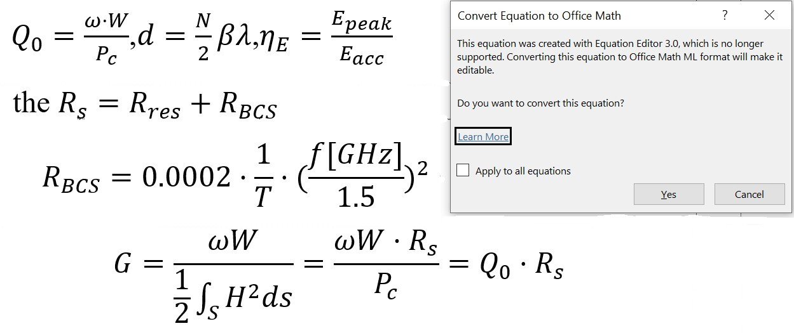

# Writing a paper in MS Word: resources

## Typesetting units

Numbers and units are typeset with an **unbreakable space** between them: use the shortcut `CTRL + SHIFT + space` to make a space that won't break at the end of the line.

**The numerical value always precedes the unit**, and a space is always used to separate the unit from the number, e. g. `10.2 m` (not `10.2m`).

The same [*should*](https://en.wikipedia.org/wiki/Degree_symbol#Typography) be done with temperature degrees: `30.2 °C` (not `30.2°C` or `30.2° C`).

The only **exceptions** to this rule are for the unit symbols for [**degree, minute, and second for plane angle**](https://en.wikipedia.org/wiki/Degree_symbol#Typography) (`°`, `'`, and `"`, respectively), for which no space is left between the numerical value and the unit symbol.

## Fix equations gone havoc

Ever encountered something like this?

You obviously encountered a Word document which used an **outdated version of the Equation Editor**, which is not supported anymore. To fix this mess double click on the equation and convert it to Office Math ML format as suggested by the floating window:

