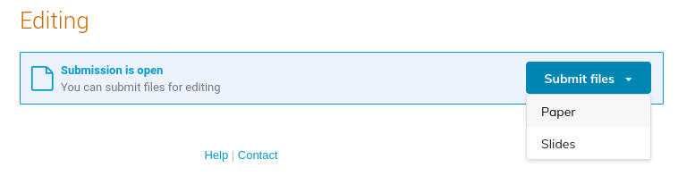
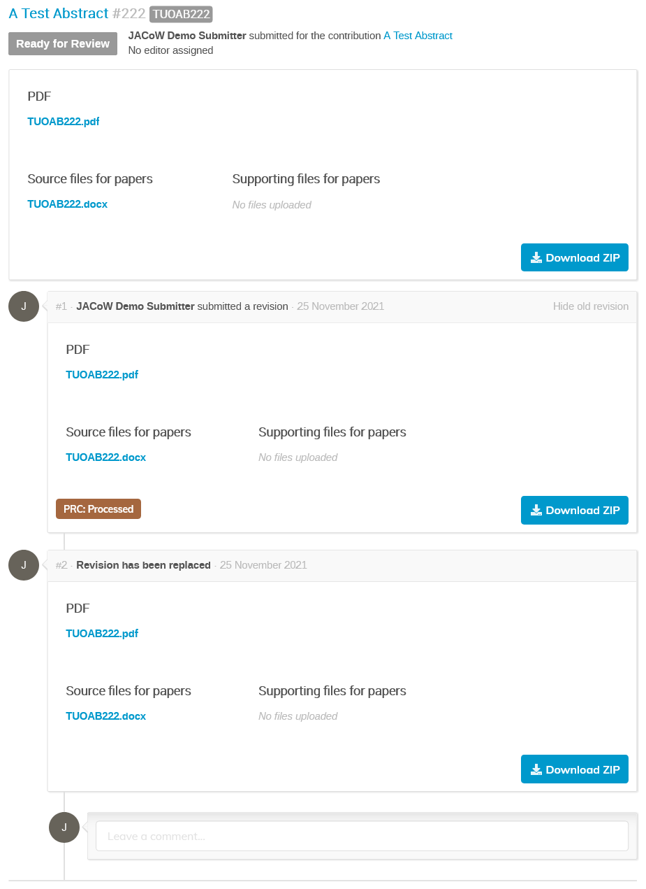

# Submit a paper to the conference

## Paper submission: the "My Contributions" area

The explanations in this section supposes that you, as an author, have already submitted an abstract to the conference and that your abstract has been accepted. In this case you will see an additional menu item on the Indico page of the conference called “My Contributions” under the “My Conference” section.

By clicking on the title of contribution (#2 in the above screenshot) you will be able to get all of its details.

---

**Note**: do NOT edit the contribution by way of the pencil icon right now. Just click on its title.

---

### Note for IPACs offering LPR

Some IPACs will offer the possibility of a [Light Peer Review process](LPRintro.md) for a subset of papers. In this case the there will be two "**Submit paper**" buttons:

**Important**: if you want to submit your paper for Light Peer Review, please follow the [LPR instructions](LPRintro.md) first. The following instructions apply for papers not to be peer reviewed or for those LPR papers already accepted by the LPR Scientific Publishing Board (SPB). For the latter case only the general "**Submit paper**" will appear since the LPR process is over for that contribution.

## Submission of files for general JACoW editing and publication

For every contribution you are a submitter there is a "**Submit files**" (or *paper*) button under the "**Editing**" section:

*This section will appear only after the administrators have opened the submission.*

In this section, you can usually submit files for up to three different editing processes: **Papers, Slides and Posters** (depending on the decision by the Editor-in-chief).

If more than one editable types are enabled in Indico, instead of the "Submit paper" button you will see a "Submit files". By clicking on it a sub-menu will be shown allowing you to select for which editable type you are submitting.

Here we will follow the process for **Papers**. Slides and posters are similar and may be described in different sections of this manual.

After clicking on the "**Submit files**" button a new upload window will appear:

You can upload files to different folders (file types). Red asterisks indicate where a file is required. Once the file has been uploaded to the folder, the asterisk becomes black. Each folder also indicates which  file extensions are authorised and if the name of the uploaded file must follow a given naming scheme (it is likely that the programme code of the contribution will be requested in the file name).

The **Submit** button will activate only when all required files will be uploaded and respect the naming patterns. **Please note that you need to press the Submit button, otherwise no files will be uploaded.**

Once submitted, you directly access the editing timeline of your contribution.

This page presents the status of the editing of your file and is where you will interact with the editor.

The upper box contains the current revision of your files (their latest version). Under it, you will see a timeline of all actions which have been taken during the editing process by the editor or by yourself in chronological order.

### Files resubmission

Please remember that until your editable is assigned to an editor, you will be able to upload new versions of the files (if needed).

To perform this task:

1. Access the "**My Contributions**" Indico  area

2. **Click on the title** of the contribution you want to submit files for

3. Click on "Go to timeline" to access the editable's timeline
   

4. Scroll all the way down to the bottom of the page and click on the "Submit files" button
   

5. Proceed as above.
