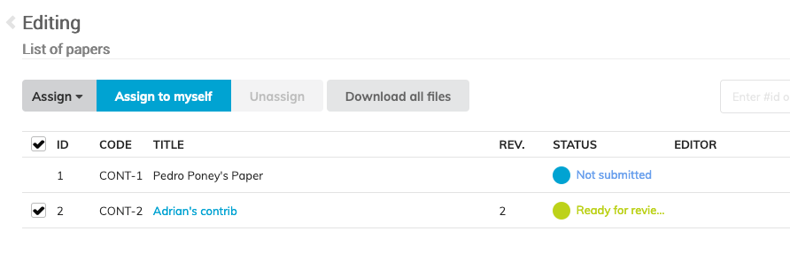

# Setting up the Editing Team

An editing team can be configured separately for each type of editable (Paper, Slides 
and Poster). Editors for a given type of editable will only be able to edit files of this type.

The editing teams can include users and/or roles.

You can define your editing team for a given editing process by clicking on the Manage Team button in the Editing team section.

You can then add multiple users and roles to the team.

You can send emails to this editing team or part of it by clicking on the  button.

If you wish the editing process to be anonymous, make sure this toggle  is activated. In this case, the names of the editors will be anonymised everywhere on the interface.

## Assigning editors to editables

Administrators can assign editors to editables by going to the list of editables () .

One or several editables can be assigned to an editor or to yourself in a go.

If you want editors to self assign editables, then make sure the `Allow editors to self-assign editables` toggle is activated on the editing configuration page.

