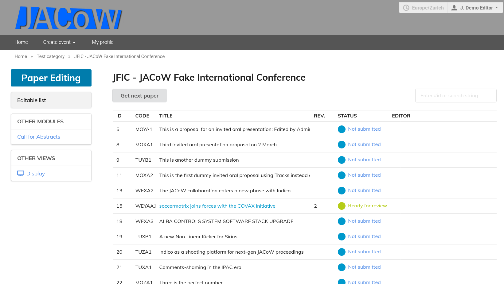
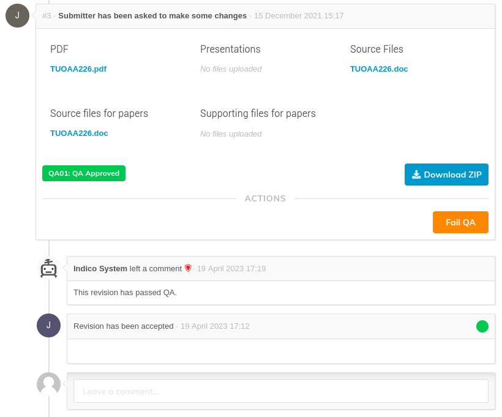

JACoW conferences strive for quality proceedings. However, it may happen that - in particular after full days of editing lots of papers - some small issues still pass unnoticed by the editor.

For this reason a second pass of checking and, eventually, editing is foreseen: we call it QA.

Usually, only a subset of (expert) editors perform this job. These editors must be members of the **"SCS"" Role** in Indico (this is built-in).

---

**Note**: these instructions primarily refer to papers but also apply to any other editable. Slides, for example, MUST be in QA state in order to get into the proceedings.

---

## QA-ing

The QA Editor usually starts from the physical copy of a paper, picked up from a pile in the Proceedings Office. Then a search for the editable is performed from the list of editables (here filtering by paper status comes useful - or just use the top-right search area).

In the editable timeline now the QA editor will see two additional buttons: **Approve QA** and **Fail QA**.

## QA OK

Whenever you Approve QA, this is shown in the timeline:

At this moment, this contribution is ready to be published in the proceedings.

## QA Failed

If the editable is not acceptable, the QA editor has the responsibility of failing QA by way of the orange button shown above.

Doing so the last revision (which is in the Accepted/<code style="color: green">green dot</code> state) is retracted and the editable should go back to the editor. Normally the QA editor is responsible for bringing the hard copy of the paper with all the comments to its editor.

