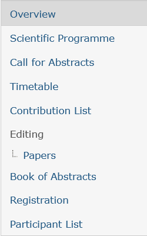
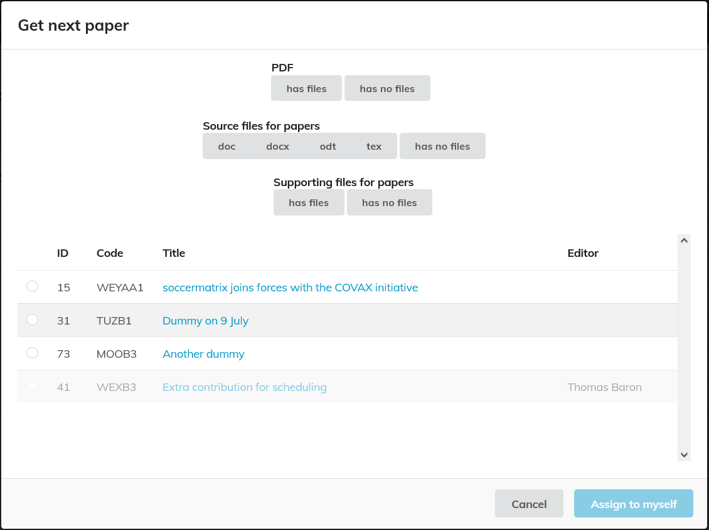
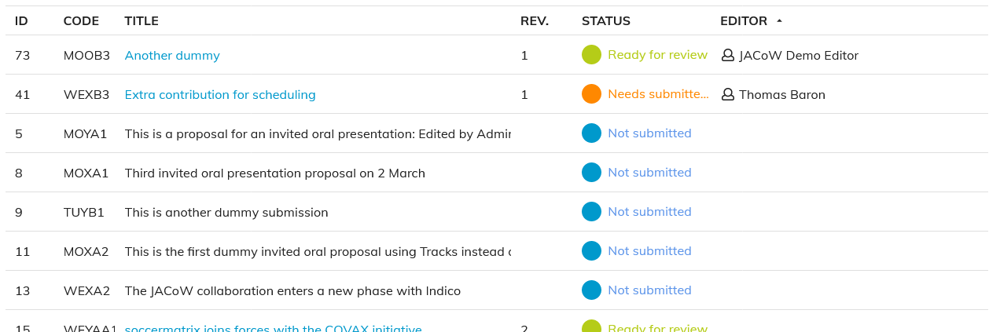

# Editor: self-assignment of editables

<video style="width:576" muted="" controls="" alt="type:video">
   <source src="../Videos/001-Welcome_to_editing_module.m4v" type="video/mp4">
</video>

An editor will access the dedicated editing area by clicking one of the options (Papers, Slides or Posters) in the “Editing” section of the left-hand side menu of the Indico page.

This gives access to the list of contributions and their statuses, and to various options.

## Getting a paper

If the administrator has activated the self-assignment option, then a “Get next paper” button appears on the editing page. Click on it to assign a new editable to yourself (otherwise, the administrator/editor-in-chief will assign one or more papers to you).

Editables can be filtered by several criteria allowing you to choose those which are more suitable to your local environment or expertise (e.g. Word or LaTeX files).

You can either select them by way of the select boxes to the left and then click on "**Assign to Myself**" or you can click on the title directly. This will open the editing timeline of that paper. You then can pick up that paper from that page directly (please see the "*Unassign*" link in the first image of the [Editing a document](edit.md) page).

If the self-assignment option is not enabled, then the editor will see directly in the list of editables which ones have been assigned to them by the editor-in-chief.

## List of assignments

In the list of editables, just click on the "Filter" button: you can then retrieve only the editables assigned to you. Similarly, you can use the filter button to only display some editables according to their status etc.

Please note that by clicking on the column header you will be able to sort the list by that field (second click = reverse sort).

By clicking on the editable title you can access its editing timeline and actually perform the editing as described in the [Editing a document](edit.md) page.
