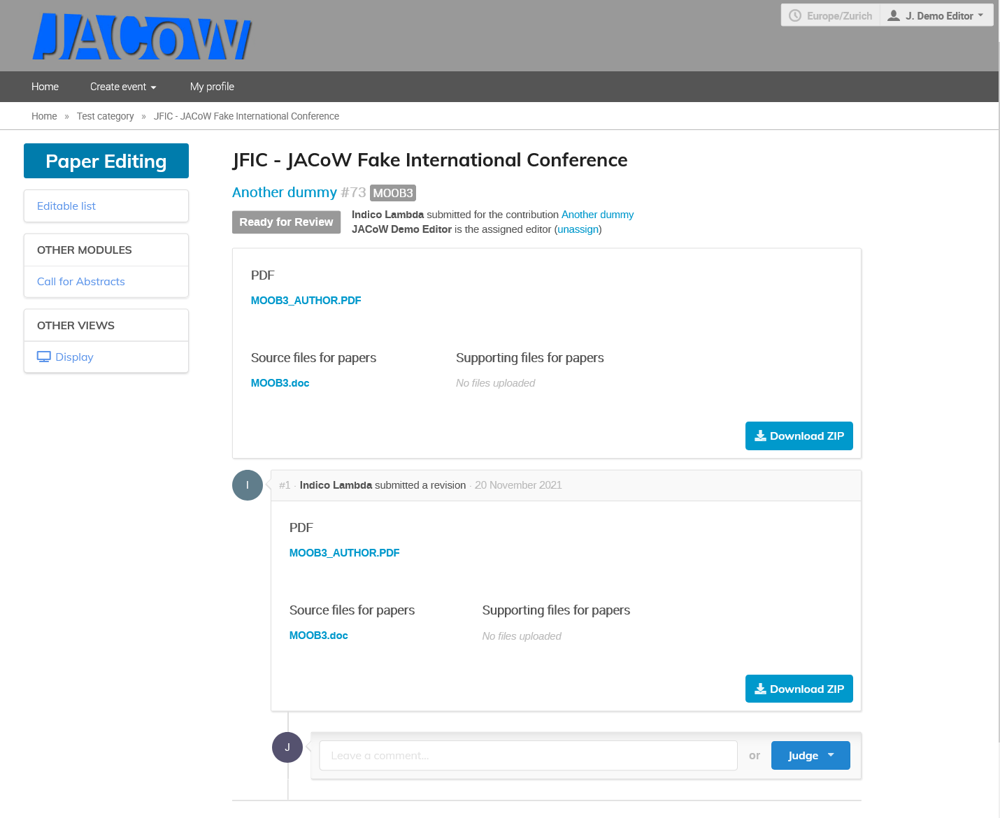
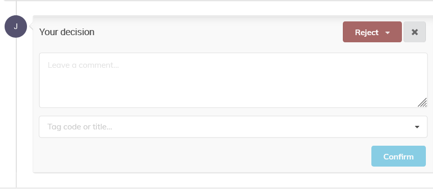
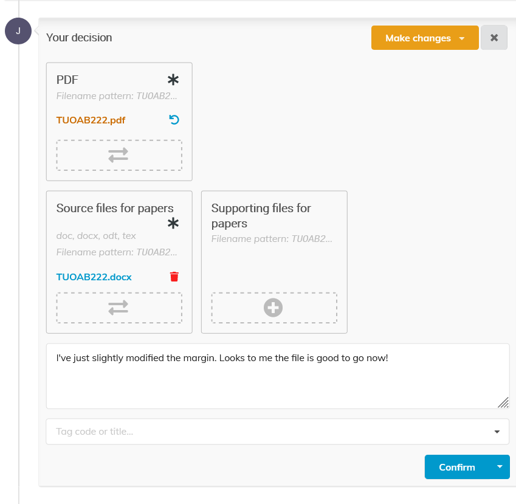
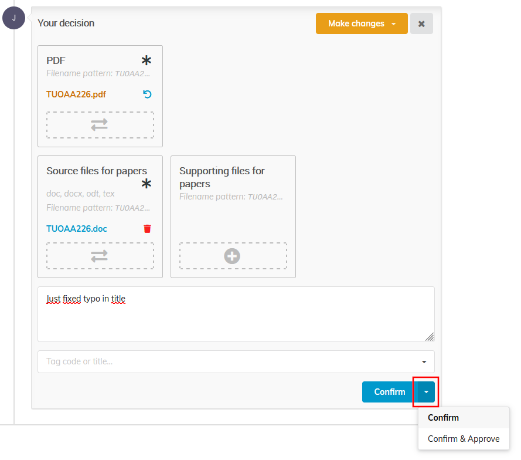
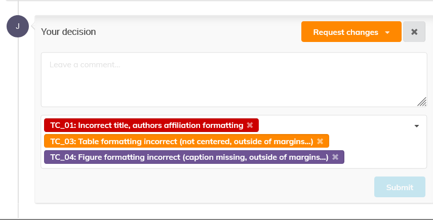
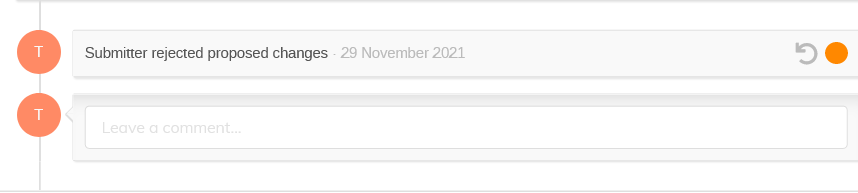

# Editing a document

Clicking on the title of the editable opens up the editing timeline. 
Revisions are represented in different boxes and actions can be 
performed on the spot with little menu-diving.

The top part of the page shows the editable title, its ID, programme code, status, submitter and assigned editor.

The first box shows the **latest** revision of the files.

Then the boxes underneath show **all the actions and comments** made during the editing process **by chronological order**.

## Commenting

Comments can be added by **any of the editors** set for the given editable type.

The visibility of a comment can be restricted to **other editors only**. In this case the submitter will not see it in their own timeline.

## Judging

Judging is the way an editor assesses an editable according to the [Editing States](../intro.md#EditingStates), in paricular **Accept** (it's OK, **Green**), **Make changes** (the editor made changes which need acceptance, **Yellow**)  or **Request changes** (to the author, **Red**).

Only  the editor assigned to the editable can assign a judgment. It is accessible at the bottom of the timeline, through the Judge button.

It gives access to 4 options:

- Accept
- *Reject* (not normally used by JACoW conferences)
- Make changes
- Request changes

### Accept (GREEN)

Choose  this option when the editable is ready for publishing. This will move 
the editable to the "Accepted" status, and notify the author by email. 
This is nearly the end of the editing process (the editable needs to pass a final QA process before being fully publishable)

### Reject (BLACK)

Choose  this option when the editable is simply rejected for publishing. It 
will move the editable to the Rejected status and notify the author by 
email. **JACoW conferences normally do not use to reject any paper**. Instead, the contibution can be withdrawn.

### Make Changes (YELLOW)

Choose this option when you have made some changes to the editable files yourself. You can upload the new files in the dialog which opens up. The  new revision will then be notified to the author by email for validation. Beware you must also submit a comment and, eventually, some tags (error codes,) or the "Confirm" button will not be activated.

If the author **rejects** your changes, they will be invited to upload a new version themselves, and you will be notified by email.

If the author **accepts** your changes, then the editable status moves to "Accepted" and this is nearly the end of the editing process (the editable needs to pass a final QA process before being fully publishable).

In both cases, you are **warned by email**. 

You  also have the possibility to bypass the author’s affiliation when uploading a new version of the file. For that purpose, use the "Confirm & Approve" button.

The new revision will then be accepted straight away.

### Request changes (RED)

Choose this option when you want the authors to make some changes themselves. 
You can then explicit your request using the Comments field and the error tags list. The status of the editable then changes to "Needs changes", and an email is sent to the author.

### Undo the last Action

You can always undo the last action you took on a paper by clicking the rounded arrow next to the status dot.

