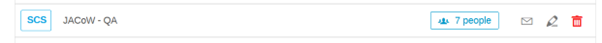
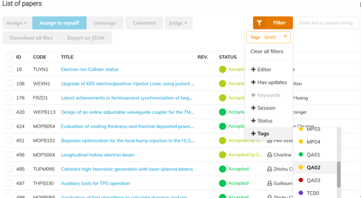
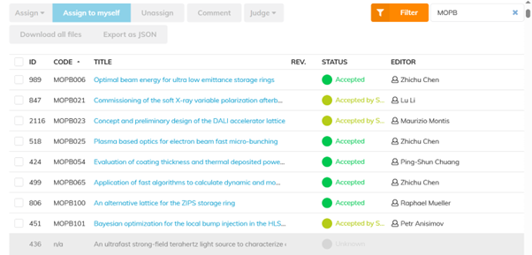
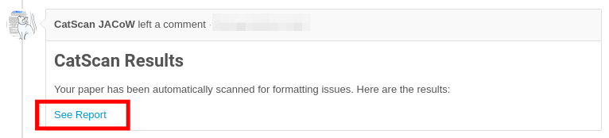

# IPAC'25 Editing reference manual

## Web References

- IPAC'25 website: [https://ipac25.org](https://ipac25.org)

- IPAC'25 Indico event: [https://indico.jacow.org/e/IPAC25)](https://indico.jacow.org/e/IPAC25)

- JACoW templates: [https://www.jacow.org/Authors](https://www.jacow.org/Authors)
  
    - [Current JACoW Template (Word)](https://github.com/JACoW-org/JACoW_Templates/raw/master/MSWord/JACoW_MSWord.pdf)
  
    - [Current JACoW Template (Word JACoW Paper Size)](https://github.com/JACoW-org/JACoW_Templates/raw/master/MSWord/JACoW_MSWord.dotx)
  
    - [ZIP file with all files](https://github.com/JACoW-org/JACoW_Templates/archive/refs/heads/master.zip)

- Instructions for Authors:
  
    - Paper Guideline: [https://ipac25.org/authorGuidelines.asp](https://ipac25.org/authorGuidelines.asp)
  
    - Paper submission: [https://ipac25.org/authorSubmission.asp](https://ipac25.org/authorSubmission.asp)
  
    - Poster guidelines: [https://ipac25.org/authorGuidelines.asp](https://ipac25.org/authorGuidelines.asp)
  
    - Speaker preparation guidelines: [https://ipac25.org//authorGuidelines.asp](https://ipac25.org//authorGuidelines.asp)
  
    - [Writing a JACoW paper](../../../Paper/Writing/general/)
  
    - [LaTeX resources](../../../Paper/Writing/latex/)
  
    - [Word resources](../../../Paper/Writing/word/)

- [Paper editing checklist](../../Editing/TemplateReview/#resources-cited-in-the-video)

- [Editor Quick Start Guide.pdf](material/Editor_Quick_Start_Guide.pdf)  ([Word version](material/Editor_Quick_Start_Guide.docx) )

- [Editor Quality Assurance Overview.pdf](../Editing/material/Editor_Quality_Matrix.pdf) 

- [JACoW Indico Conference Tools](https://www.jacow.org/jict_ipac25/)

---
## Paper QA - Give it a go IPAC'25 QA Work Flow

The dependency of printed papers to facilitate workflows in SMPS, and Indico for QA have often resulted in confusion and corruption due to duplicate papers and unprinted papers.
Thos below is the proposed workflow we will try for IPAC'25.
### Paper Editors
All paper editors will stop printing any of their completed Green papers, this will become the responsibility of the QA Editor.
### Title Author Check
The Title Author Check will be conducted in parallel, best effort will be made to place QA Pass papers in QA Pass pile next to Title Author Check.
#### Stream 1
Title Author Check can take for this pile to review the Title Authors. 
If problems are found which require the fix of the paper the QA Pass will have to be rolled back and paper status set to the appropriate state for editing by the Author or the Editor.
 #### Stream 2
If there are no papers in the QA complete the Title Author Checker will select ready to check papers from the interface and conduct the review.
If problems are found which require modifying the paper they will approach the Editor for the paper and inform them. The Editor will rollback and make correction, or Judge Red so the Author can fix and upload again. 
Corrections at the pre-QA stage will prevent further roll backs or QA fail if discovered after QA Pass.   
### QA Editor
#### QA Editor Role Allocation 
QA Editors is a role and before you can undertake QA Editing an admin needs to add your name to the Role in the Indico Rolls Setup page.

 
#### Setting up you Filters
Viewing only the papers which are read for QA can de achieved by using the Filter in the Editing > List of Papers Page. You will click on the Filter, Select Tags > QA02. You should then see paper which have either “Accepted by Submitter” or “Accepted”. 


 
Sort the List by program Code which will display the list sorted by Program Code which is typically day.
#### Viewing the Papers you will QA
You will be advised the Day or Day and Session which you will be allocated to QA which is unique to yourself so other editors don’t start working on papers you are working on.
For example “MOPB”, but typing this into the Text Box next to the Filter button, any other contributions will be greyed out leaving only the papers you will QA.


  

#### Printing Papers
Once you are working on your group of papers, after clicking into a paper to QA you can download the last PDF and print. 
Note the name of the editor who edited the paper on the top of the paper. If you are the Editor of the paper hand over the printed paper to another QA Editor.
#### QA - Quality Assurance procedure
Click here to get [precise instructions on how to perform this with Indico](../../Editor/QA/).
1. Take the paper that you printer, and that **you did not process** initially.
2. Open the PDF you printed.
**There are two minimum requirements for a paper to be accepted for publication on JACoW:**
- It meets the technical requirements (fonts, page size, performance, etc.).
- Its general appearance is close to the template (i.e., the content fits within the margins and the title is in uppercase letters; Fig./Figure, missing punctuation, typos, and other minor errors do not matter at this point).
Then perform the following checks:
1. The **number of pages** is in the allowed range for that presentation type.
2. All pages of the document display without error.
3. All pages of the document display in <5 seconds.
4. Check the **margins** once more.
5. Look carefully at the text and check equations and figures for strange or bad fonts.
6. At this stage we can accept minor problems, however. If in doubt, consult with the Editor-in-Chief.
##### If everything is OK
- Writer your name in the comment box, **Your Name, QA OK**, set the comment not visible to Author Flag.
- Choose **Approve QA** and submit.
- Mark or write "**QA OK**", sign the paper, and then return all paperwork to the QA'd Passed folder on the Authors' reception desk
##### If anything is NOT OK
- Add a comment in the Indico timeline describing the issues you spotted. This will help the editor fix them or get them back to the author. Make sure to include your name as the QA Editor.
- Then, select **Fail QA** in Indico.
- Mark the printed paper as FAILED and return it to the editor. 
  The editing process will then restart.


## Editor Computers

You have been placed at a workstation which has been selected based on you editing experises, and to distribute tranee editors amoungst experienced editors who can help them grow thier experties. You must stay on the same computer throughout the conference.

All of the software settings and preferences should already be set, but if you thinks something's wrong, please contact the editor-in-chief.

You will find on the Windows desktop a folder named **PO** (short for **P**roceedings **O**ffice). This is the only folder that is backed up, so please **DO NOT RENAME OR MOVE IT**. **Use this folder for all the papers you are working on**. There is also a folder named **DONE** inside PO (if missing, go and create it). When you are done processing a paper (successfully or not, it doesn't matter), create a sub-folder under the DONE folder and name it according to its paper code. Move all of that paper's files into the new sub-folder.

*Example* When working on paper MOPC999, all its files will stay in

`C:\Users\XXXX\Desktop\PO`

(i.e., the PO folder on your desktop). 

When you're done, all the processed files of that paper should be moved to

`C:\Users\XXXX\Desktop\PO\DONE\MOPC999`

---

## Programme codes explained

### Example

```
MOPC999 = MO P C 999

<paper-code> = <day> <presentation-type> <location> <number>
```

### BNF & explanation

```
<paper-code>        ::= <day> <presentation-type> <location> <seq-number>
<day>               ::= "SU" | "MO" | "TU" | "WE" | "TH" | "FR" 
<presentation-type> ::= "X" | "Y" | "Z" | "A" | "B" | "C" | "P" | "U" | "V" | "E" | "W" | "F"
<location>          ::= "P" | "D" | "N" | "M" | "S" | "B"
<number>            ::= <digit> |  <digit>  <digit>  |  <digit>  <digit>  <digit> 
```

| Day                | Presentation Type      | Location                                      |
| ------------------ | ---------------------- | --------------------------------------------- |
| **SU** - Sunday    | **X** – Invited #1     | **P** - Plenary Hall, TICC                    |
| **MO** - Monday    | **Y** – Invited #2     | **D** - Hall 101 (Ground Floor), TICC         |
| **TU** - Tuesday   | **Z** – Invited #3     | **N** - HAll 201, TICC                        |
| **WE** - Wednesday | **A** – Contributed #1 | **M** – Exhibit Hall A Magpie, TWTC           |
| **TH** - Thursday  | **B** – Contributed #2 | **S** – Exhibit Hall A Salmon, TWTC           |
| **FR** - Friday    | **C** – Contributed #3 | **B** – Exhibit Hall A Bear, TWTC             |
|                    | **P** – Poster         |                                               |
|                    | **U** – Industry #1    |                                               |
|                    | **V** – Industry #2    |                                               |
|                    | **E** – Entertainment  | TICC - Taipei International Convention Center |
|                    |                        | TWTC - Taipei World Trade Center              |
|                    |                        |                                               |

### Presentation type codes and paper length

| Type code | Paper length                                               |
| --------- | ---------------------------------------------------------- |
| X, Y, Z   | Invited contributions: **5 pages** + 1 for references only |
| U, V      | Industry session: **5 pages** + 1 for references only      |
| A, B, C   | Contributed Oral: **3 pages** + 1 for references only      |
| P         | Poster: **3 pages** + 1 for references only                |

---

## Editing a paper

### Visual workflow


### Paper statuses recap

- <code style="color: green">Green dot</code>
  
    - Perfect paper, also in JACoW size
    - Paper can go to QA

- <code style="color: gold">Yellow dot</code>
  
    - Source file changed to fix problems
    - Author will proofread and approve or reject

- <code style="color: red">Red dot</code>
  
    - Extensive work necessary, author should fix and resubmit

### Editing workflow, step-by-step

1. [Assign yourself a paper](../Editor/assign.md)

2. **[Word source files only]** check the CatScan results in the comments. They will help you spot any problems in the PDF.
   

3. Try and **edit the latest PDF file first**. Follow the [Paper Editing Checklist](../../Editing/TemplateReview/).

4. If the result is compliant with JACoW quality (both on screen and on [print](#how-to-print-a-paper)) you can upload to Indico and [stick a **<code style="color: green">GREEN</code>** dot ("Accept")](../../Editor/edit/#accept-green).
   
     - If you needed to do small fixes in the PDF, remember to upload it as well. Select Request approval (<code style="color: gold">YELLOW</code>) and then [Confirm and approve it](../../Editor/edit/#confirm-and-approve) to have it green directly
       
       Go to step 6.

5. Otherwise, **working on the source files is needed**. Choose one of the following options
   
     1. **Lots of fixes are needed**, this will take some time. Or, few fixes are needed but you will spend too much time (>10'). Or, you may be not able to fix it due to lack of information (missing figure, missing reference, etc.).
        **Stick a <code style="color: red">RED</code> dot and [ask the author to resubmit a better version](Editor/edit/#request-changes-red)**.
   
     2. **You can fix it quickly in the source file**. 
        Re-create the PDF and do all the checks again. Upload all the files (PDF+source) and [Request approval (<code style="color: gold">YELLOW</code>)](../../Editor/edit/#request-approval-yellow).
        
        **NOTE**: For Word files on Windows , use the **Adobe PDF Printer** with JACoW's settings - **DO NOT USE** *»PDFMaker«* nor *»Save As PDF«* in Word nor any *»Generic PostScript Printer«*.
        
        Move on to another paper, back to step 1.

6. Whenever the paper is accepted (<code style="color: green">GREEN</code>) **bring the paper copy to a QA editor** for its last check.

### How to print a paper

Print the dotted paper with the JACoW stamping tool in Acrobat:

1. Classic Acrobat interface: menu `File` → `GREEN dot`
   

2. New Acrobat interface: `Menu` → `Plugins` → `For files` → `GREEN dot`
   

**Note**: No need to print Yellow and Red papers anymore.

Sometimes papers look good on screen and awful in print. Both media should be OK.
If the PDF is not printable, proceed with the electronic steps only and then assign a red dot.

---


## Suggestions to Indico, to IPAC'25+ organisers etc.

Please share your idea, comments, suggestions for a better organisation of such events, in particular about the use of Indico.

Open your browser to the [Telegra.ph free online service](https://telegra.ph/): [https://telegra.ph/](https://telegra.ph/)

Here you can create a rich text page (text, images, etc.) editable only from your browser.  
At the end of your editing be sure to **Publish it** (use the top-right *Publish* button), copy this page's URL and send it to the Editor-in-chief.

We recommend to create one page only per person, but feel free to edit more than one to separate contexts (e.g., Indico, general organisation, Acrobat editing, LaTeX...). In this case you'll get one URL per page. Be sure to save them all!
