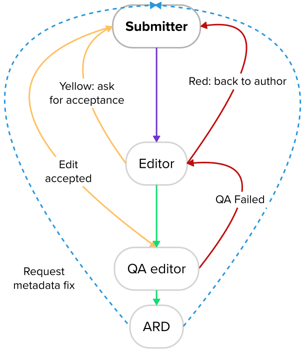
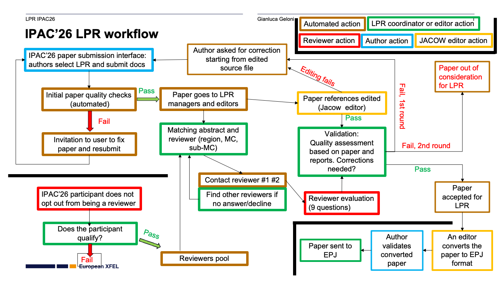
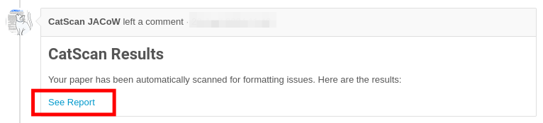
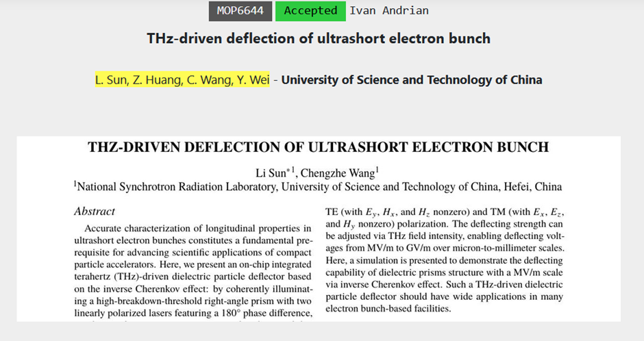
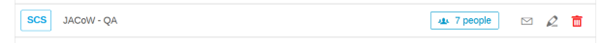
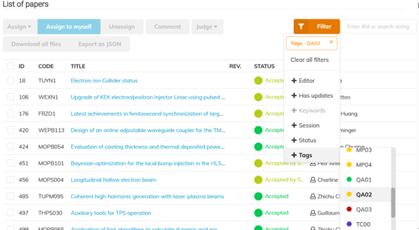
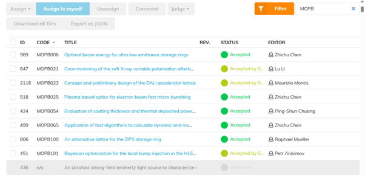

# IPAC'26 Editing reference manual

## History updates

- 2026-05-12T01:16 *Nicolas Delerue*: first version

- 2026-05-17T10:30 *Ivan Andrian*: 
  [TAC-e01: Authors appear in the indico contribution but not on the paper, or vice-versa](#tac-e01-authors-appear-in-the-indico-contribution-but-not-on-the-paper-or-vice-versa)

## Main changes with respect to previous IPACs

- Some Scientific Program Committee (SPC) members expressed concern with the high rate (about 30%) of posters that were not converted in proceedings papers at previous IPACs. One concern expressed by some authors to SPC members was that publishing in the IPAC proceedings may prevent a journal publication later. To address this issue, in agreement with the JACoW board of directors, authors have been given the option to ask for their paper to have a preprint watermark (as was alredy done for papers accepted by the Light Peer Review volume).

- The SPC chair asked to remove the limit forbidding references to go on a 5th page of a paper. After checking with the JACoW board of directors and the IPAC CC, the origin of that rule could not be found and it has been removed. Papers are limited to 3 or 5 pages depending on their type but references can go on extra pages without limit. 

- The SPC has decided to highlight some posters called "Invited Posters (V)". This is an opportunity to highlight more interesting contributions without increasing the number of oral contributions. These invited posters are allowed to submit 5 pages of proceedings like oral contributions.

- To make access to the author's work faster, all papers will be made available on the contribution page once submitted and they will be updated once the paper has passed QA.

- Like at IPAC'23, there is a call for peer-reviewed papers (Light Peer Review - LPR) to which 235 papers have been submitted. These papers will be published in a journal (for this IPAC it is the European Physics Journal who submitted the most competitive offer and has been chosen). In agreement with the LPR coordinator, we will edit the LPR papers before the second round of reviews and cross-check them once they are in their final version. The aim is to have the same papers published in the journal version and the JACoW proceedings, benefiting from both the reviewers' comments and the editors work (this is described further below).

- JACoW has introduced new templates for this years' conference season. More details on the changes to theses templates can be found at [here: https://github.com/JACoW-org/JACoW_Templates/blob/master/Changelog.pdf](https://github.com/JACoW-org/JACoW_Templates/blob/master/Changelog.pdf). 

- JACoW has introduced a new policy requiring all authors affiliation to follow the [Research Organization Registry](https://ror.org/) nomenclature (with some exceptions). To help authors use the right format authors have been provided with the possibility to download a custom template pre-filled with the authors lists and affiliations and the title and abstract of their papers.

- By lack of sufficient ressources and due to a late notification, we have not been able to update CatScan for this conference.

## Editing motivation and philosophy

The proceedings record what has been presented at the conference and give a snapshot of the state of the art for particle accelerators at the time of the conference. Each paper is a contribution to this snapshot. The editor's work is to ensure that this snapshot is not blurred by technical issues.

However, at the same time, there is a pressure to ensure that the editorial team delivers good value for money. We should aim at delivering paper that are free of major typographical problems but should not loose too much time in minor details that do not affect the readability of the paper for accelerator scientists. We do not aim at delivering an artistic masterpiece of well polished papers. Looking at the Light Peer Reviewed papers from IPAC'23, which have been index by major publication databases, minor typographical issues were accepted by the journal and did not affect the papers referencing.

References are especially important as they contribute to the reader's underatanding of a paper. Papers that do not give DOI for recent journal publications should be red-dot and returned to their authors.

My personnal opinion is that we should educate the authors: when there are too many errors in a paper, we should return it to the author rather than loosing time fixing the errors.

## Guidelines

- JACoW templates: [https://www.jacow.org/Authors/Templates](https://www.jacow.org/Authors/Templates)
  
    - [Current JACoW Template (LaTeX)](https://github.com/JACoW-org/JACoW_Templates/raw/master/LaTeX/jacow_latex_template.tex)
  
    - [Current JACoW Template (Word)](https://github.com/JACoW-org/JACoW_Templates/raw/master/MSWord/JACoW_MSWord.dotx)
  
    - [ZIP file with all files](https://github.com/JACoW-org/JACoW_Templates/archive/refs/heads/master.zip)

- Instructions for Authors:
  
    - Paper preparation Guidelines: [https://www.ipac26.org/paper-preparation/](https://www.ipac26.org/paper-preparation/)
  
    - Speaker preparation guidelines: [https://www.ipac26.org/speaker-preparation-guidelines/](https://www.ipac26.org/speaker-preparation-guidelines/)

- [Paper editing checklist](../../Editing/TemplateReview/#resources-cited-in-the-video)

- [Editor Quick Start Guide.pdf](material/Editor_Quick_Start_Guide.pdf)  ([Word version](material/Editor_Quick_Start_Guide.docx) )

- [Editor Quality Assurance Overview.pdf](../Editing/material/Editor_Quality_Matrix.pdf) 

- [JACoW Indico Conference Tools for IPAC'26](https://jict.ipac26.org/)

---

## Editor Computers

You have been placed at a workstation which has been selected based on you editing experises, and to distribute tranee editors amoungst experienced editors who can help them grow thier experties. You must stay on the same computer throughout the conference.

All of the software settings and preferences should already be set, but if you thinks something's wrong, please contact the editor-in-chief.

You will find on the Windows desktop a folder named **PO** (short for **P**roceedings **O**ffice). This is the only folder that is backed up, so please **DO NOT RENAME OR MOVE IT**. **Use this folder for all the papers you are working on**. There is also a folder named **DONE** inside PO (if missing, go and create it). When you are done processing a paper (successfully or not, it doesn't matter), create a sub-folder under the DONE folder and name it according to its paper code. Move all of that paper's files into the new sub-folder.

*Example* When working on paper MOPC999, all its files will stay in

`C:\Users\XXXX\Desktop\PO\MOPC999`

(i.e., the PO folder on your desktop). 

When you're done, all the processed files of that paper should be moved to

`C:\Users\XXXX\Desktop\PO\DONE\MOPC999`

---

## Programme codes explained

### Example

*Contribution code format:*

```
    DDTML00
```

    DD=Day of week ("SU" | "MO" | "TU" | "WE" | "TH" | "FR")
    T = Type (I=Invited oral, O=contributed Oral, V = inVited poster, P = contributed Poster, E= Equal Opportunity, U = indUstrial, S= sponsored talk, Z= priZe acceptance oral)
    M = MC number (1-8) [0 may be used for contributions that fall outside the regular classification]
    L00= Location code + number
        For orals (I,O, E, U, S, Z): M = Room Michel Ornano; T = Room Thalasso + 2 digits chronological sequence
        For posters the first digit is related to the papers' primary author region: 
            001-299  = EMEA (Europe Middle East and Africa)
            301-599  = Americas
            601-899  = Asia
            901-999  = Unknown
        To keep more freedom in oposter arrangements, the program code does not include an indication of the area where the poster will be presented.
    
    Note: Some authors may choose to affiliate themselves with IUPAP (International Union of Pure and Applied PHysics) whose headquarters is in Switzerland, in that case their region is EMEA.
    
    - Each MC will be presented during two different poster sessions, one mostly for EMEA posters and the other for the other regions.
    There might be exceptions to this rule due to authors request to have their poster presented on a different day.
    
    - Sunday: Students poster sesion. Papers with a code starting with SU are also presented during the conference main program under another code, we should reject (black dot) such paper and ask the author to resubmit with the code from the main program.
    
    - Monday:
    MC1 (Europe, Middle-East and Africa), MC6 (Americas and Asia), MC7 (Europe, Middle-East and Africa) and MC8 (Americas and Asia).
    
    - Tuesday:
    MC2 (Americas and Asia), MC3 (Europe, Middle-East and Africa), MC7 (Americas and Asia), MC8 (Europe, Middle-East and Africa)
    
    - Wednesday:
    MC1 (Americas and Asia), MC4 (Americas and Asia), MC5 (Europe, Middle-East and Africa), MC6 (Europe, Middle-East and Africa)
    
    - Thursday
    MC2 (Europe, Middle-East and Africa), MC3 (Americas and Asia), MC4 (Europe, Middle-East and Africa), MC5 (Americas and Asia)

| Day                | Presentation Type                 | Location                   |
| ------------------ | --------------------------------- | -------------------------- |
| **SU** - Sunday    | **I** – Invited Oral              | **M** - Room Michel Ornano |
| **MO** - Monday    | **O** – Contributed Oral          | **T** - Room Thalasso      |
| **TU** - Tuesday   | **V** – Invited Poster            |                            |
| **WE** - Wednesday | **P** – Contributed Poster        |                            |
| **TH** - Thursday  | **E** – Equal Opportunity session |                            |
| **FR** - Friday    | **U** – Industrial session        |                            |
|                    | **S** – Sponsored talk            |                            |
|                    | **Z** – priZe acceptance talk     |                            |
|                    |                                   |                            |

### Presentation type codes and paper length

| Type code        | Paper length                                  |
| ---------------- | --------------------------------------------- |
| I, O, V, E, U, Z | **5 pages** + extra pages for references only |
| P                | **3 pages** + extra pages for references only |
| S                | No paper will be included in the proceedings  |

---

## Editing a paper

### Visual workflow (non LPR papers)



### Visual workflow (LPR papers)



### Paper statuses recap

- <code style="color: green">Green dot</code>
  
    - Perfect paper, also in JACoW size
    - Paper can go to QA

- <code style="color: gold">Yellow dot</code>
  
    - Source file changed to fix problems
    - Author will proofread and approve or reject

- <code style="color: red">Red dot</code>
  
    - Extensive work necessary, author should fix and resubmit

- <code style="color: black">Black dot</code>
  
    - Paper rejected (for example paper from the student session)

### Editing workflow, step-by-step

1. Some papers will be assigned to you by the Editor-in-chief or [Assign yourself a paper](../Editor/assign.md)

2. **[Word source files only]** check the CatScan results in the comments. They will help you spot any problems in the PDF.
   

3. Try and **edit the latest PDF file first**. Follow the [Paper Editing Checklist](../../Editing/TemplateReview/).

4. Check that the **number of pages** is in the allowed range for that presentation type (see #Presentation-type-codes-and-paper-length).

5. If the result is compliant with JACoW quality you can upload to Indico and [stick a **<code style="color: green">GREEN</code>** dot ("Accept")](../../Editor/edit/#accept-green).
   
     - If you needed to do small fixes in the PDF, remember to upload it as well. Select Request approval (<code style="color: gold">YELLOW</code>) and then [Confirm and approve it](../../Editor/edit/#confirm-and-approve) to have it green directly
       
       Go to step 6.

6. Otherwise, **working on the source files is needed**. Choose one of the following options
   
     1. **Lots of fixes are needed**, this will take some time. Or, few fixes are needed but you will spend too much time (>10'). Or, you may be not able to fix it due to lack of information (missing figure, missing reference, etc.).
        **Stick a <code style="color: red">RED</code> dot and [ask the author to resubmit a better version](Editor/edit/#request-changes-red)**.
   
     2. **You can fix it quickly in the source file**. 
        Re-create the PDF and do all the checks again. Upload all the files (PDF+source) and [Request approval (<code style="color: gold">YELLOW</code>)](../../Editor/edit/#request-approval-yellow).
        
        **NOTE**: For Word files on Windows , use the **Adobe PDF Printer** with JACoW's settings - **DO NOT USE** *»PDFMaker«* nor *»Save As PDF«* in Word nor any *»Generic PostScript Printer«*.
        
        Move on to another paper, back to step 1.

7. Whenever the paper is accepted (<code style="color: green">GREEN</code>) **bring the paper copy to a QA editor** for its last check.

## Title Author Check (TAC - *Giulia*, *Lu Li*)

The Title Author Check will be conducted in parallel, as early as possible after a paper is submitted and before QA assessment.

Special cases that will need involvement of both TAC and editors (plus, of course, authors) are listed here below.

### TAC-e01: Authors appear in the indico contribution but not on the paper, or vice-versa

Example:



During TAC, if co-authors appear in the indico contribution but not on 
the paper, or viceversa, we operate like this:

1. **TAC** writes a comment in the timeline with the message below to notify the author (email sent by Indico)

2. **TAC** asks **the editor** (in presence, via mattermost...) to **revert the green dot into yellow dot**. For the latter, the editor needs to re-upload their latest files when yellow-dotting

3. **the author** has 2 options:
   
     1. **modify the authors list in Indico** and then accept **the yellow dot** that becomes green
   
     2. **reject the yellow dot**, modify the paper and re-upload the correct 
        one with authors list as per Indico. After that the editor will be 
        notified and can review and eventually accept the paper 

Standard comment by TAC to the author:


```
Dear Author, please be informed that the paper author and co-authors list
is not coherent with the Indico list. 
Please make sure to modify the wrong one either in Indico or in the paper,
so that they will be then identical. The editor will move the status of 
the paper to yellow waiting for your actions:

- after only modifying Indico, accept the editing
- if you want to modify the paper, reject the editing and resubmit 
  the correct version of the latest updated paper.
```


----


## QA - Quality Assurance procedure

#### QA Editor Role Allocation

QA Editors is a **Role**, and before you can undertake QA Editing an admin needs to add your name to the Role **JACoW - QA** in the Indico Rolls Setup page.


#### Setting up you Filters

Viewing only the papers which are ready for QA can de achieved by using the Filter in the Editing > List of Papers Page. You will click on the Filter, Select Tags > <code style="color: yellow">QA02</code>. You should then see paper which have either <code style="color: green">Accepted by Submitter</code> or <code style="color: green">Accepted</code>. 


Sort the List by program **Code** which will display the list sorted by Program Code which is typically by day.

#### Viewing the Papers you will QA

You will be advised the Day or Day and Session which you will be allocated to QA which is unique to yourself so other editors don’t start working on papers you are working on.
For example “MOP1”, but typing this into the Text Box next to the Filter button, any other contributions will be greyed out leaving only the papers you will QA.

Click here to get [precise instructions on how to perform this with Indico](../../Editor/QA/).

### Workflow

1. Take a paper that **you did not process** initially from the QA folder.

2. Download the PDF file from the server.

**There are two minimum requirements for a paper to be accepted for publication on JACoW:**

- It meets the technical requirements (fonts, page size, performance, etc.).

- Its general appearance is close to the template (i.e., the content fits within the margins and the title is in uppercase letters; Fig./Figure, missing punctuation, typos, and other minor errors do not matter at this point).

Then perform the following checks:

1. The **number of pages** is in the allowed range for that presentation type.

2. All pages of the document display without error.

3. All pages of the document display in <5 seconds.

4. Check the **margins** once more.

5. Look carefully at the text and check equations and figures for strange or bad fonts.

6. At this stage we can accept minor problems, however. If in doubt, consult with the Editor-in-Chief.

#### If everything is OK

- Choose **Approve QA** and submit.
- Mark or write "**QA OK**", sign the paper, and then return all paperwork to the QA'd folder on the Authors' reception desk

#### If anything is NOT OK

- Add a comment in the Indico timeline describing the issues you spotted. This will help the editor fix them or get them back to the author.

- Then, select **Fail QA** in Indico.

- Mark the printed paper as FAILED and return it to the editor. 
  The editing process will then restart.

---

## Sentence case for titles: How-To

Please note that in Indico now on titles should be written in [Sentence case](https://writer.com/blog/sentence-case/) (no more in Title Case). Example: `This is a paper title in SCL: sentence case letters`.

Remember that acronyms and specifically-written names of machines/institutes must
 not be changed from their format.

To quickly change a wrongly formatted title you can use [https://titlecaseconverter.com/](https://titlecaseconverter.com/) with the **Sentence case Style**.

Of course **in the paper titles must be in FULL UPPERCASE**.

---

## Suggestions to Indico, to IPAC'27+ organisers etc.

Please share your idea, comments, suggestions for a better organisation of such events, in particular about the use of Indico.

Open your browser to the [Telegra.ph free online service](https://telegra.ph/): [https://telegra.ph/](https://telegra.ph/)

Here you can create a rich text page (text, images, etc.) editable only from your browser.  
At the end of your editing be sure to **Publish it** (use the top-right *Publish* button), copy this page's URL and send it to the Editor-in-chief.

We recommend to create one page only per person, but feel free to edit more than one to separate contexts (e.g., Indico, general organisation, Acrobat editing, LaTeX...). In this case you'll get one URL per page. Be sure to save them all!

## Web References

- IPAC'26 website: [https://ipac26.org](https://ipac26.org)

- IPAC'26 Indico event: [https://indico.jacow.org/e/IPAC26](https://indico.jacow.org/e/IPAC26)
