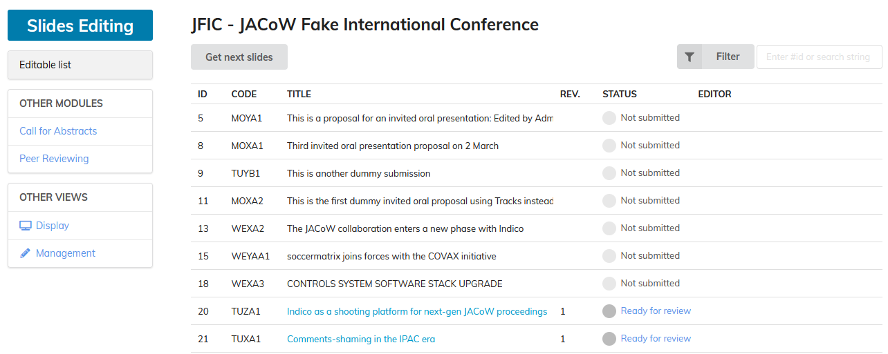

# Processing slides - Introduction

The aim of the slides processing editor is to produce JACoW compliant PDF files of the presentations for inclusion in the proceedings.

You do not have to edit the typesetting or layout, but you still have to make sure of the following:

- all fonts must be embedded

- all missing characters should be fixed

- slides should be free of overlapping issues

- multimedia content (videos, animated GIFs) should be embedded

- backup slides (named extra slides or additional slides) should be removed

---

**Please note:** slides should only be *processed after the talk has been given* to make sure that it is the final version without last minute changes. 

---

Editors and presentation managers need slides processing privileges to see the link for editing slides in the Indico module as shown in the given screenshot below:

The Indico slides editing environment shows a list of all contributions (papers and talks) which have been submitted to a conference. Each row starts with an ID and a contribution code, followed by the title, the number of uploaded revisions, the processing status and at least the name of the editor who processed the contribution.

The following video tutorial gives an impression about the basic processing procedure for slides:

<video style="width:576" controls="" alt="type:video">
   <source src="../Videos/SlidesProcessingIntro.mp4" type="video/mp4">
Your browser does not support the video tag.
</video>

## What's next?

Before you start processing slides see the [Prerequisites](2_Prerequisites.md) section to learn more about the software you need to install first, like video transcoders and other fancy stuff.
