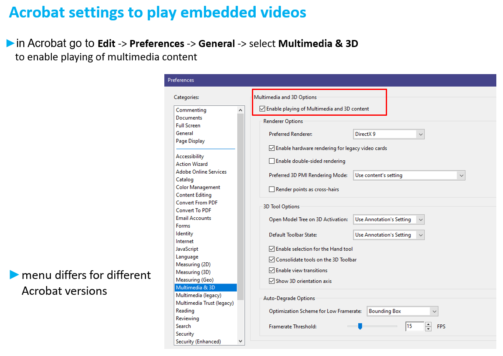
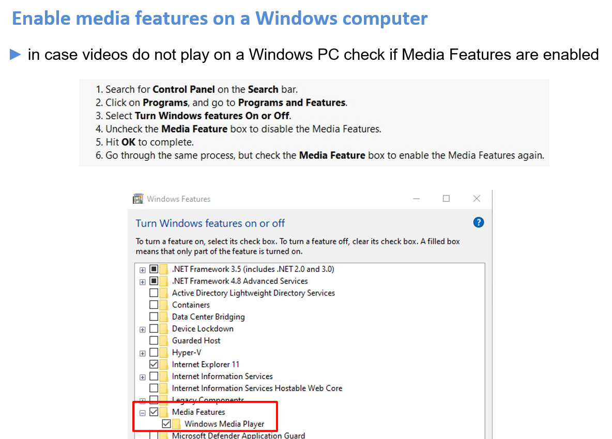

# Processing slides - Prerequisites

## AKA: how to prepare your workstation in the proceedings office

The conference organiser is responsible for the PC set-up,  but for processing slides some extra work is required:

- **install video transcoders and other useful software, like Handbrake, Virtual Dub, Convertio**
  
  [Handbrake](https://handbrake.fr/downloads.php) is a video transcoder to convert video files (e.g. .avi to .mp4).
  
  [Virtual Dub](https://sourceforge.net/projects/virtualdub/) is another option to convert video files.
  
  [Convertio](https://convertio.co) is a powerful file converter. It converts animated GIFs directly to mp4 - online and for free through the web browser

- **install [PPsplit](http://www.maxonthenet.altervista.org/ppsplit.php) (PowerPoint Add-in to split overlaps)**

- **modify PowerPoint print options to convert slides in High Quality:**
  
  Setting the print option to High Quality improves the conversion to PDF especially for images.

- **make sure the latest [JACoW.joboptions](https://github.com/JACoW-org/AcrobatPitStopTools) file is installed**

    It is needed for the Acrobat Distiller and the Adobe PDF printer. 
    Import in Acrobat Distiller via `Settings|Add Adobe PDF Settings`.

- **check Acrobat settings to play embedded videos**
  
  In Acrobat go to **Edit|Preferences|General** and select **Multimedia & 3D** to enable playing of multimedia content:
  
  
  
  Change the Player Options to Windows Built-In Player:
  
  

- **enable media features on a Windows PC**
  
  

## Optional steps

- install Macintosh fonts on a Windows PC (Mac slides can be an issue when opened on a Windows machine)

- install [Lightshot](https://app.prntscr.com) (a tool for making screenshots)

## What's next?

Follow the [instructions for editing PDF slides](3_PDF_slides.md) to learn how to process PDF slides.
