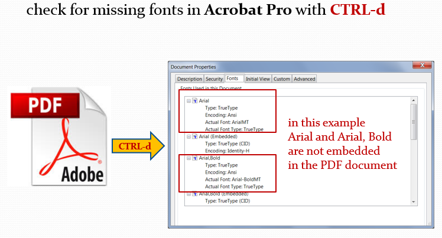
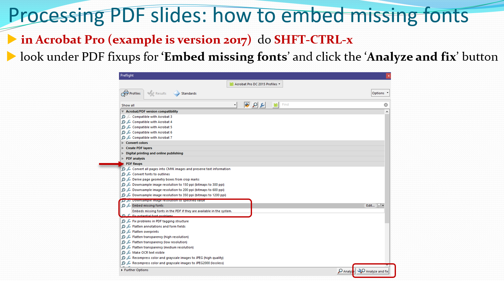

# Processing PDF slides

There are different processing procedures for PDF slides and PowerPoint presentations. For PDF slides the following steps should be done:

- **check for missing fonts** in Acrobat with shortcut-key CTRL-D

- **do a visual inspection** of the presentation and look for overlapping content or missing characters. Missing characters are displayed as blank boxes. Macintosh talks processed on a Windows computer can be an issue.
  
  Overlapping content can be fixed in the corresponding PowerPoint slides file which has been uploaded by the speaker as a "Source file".

- **remove backup slides** in Acrobat. Some speakers prepare extra or spare slides for their presentation - these so called backup slides should be removed before publication.

## How to embed missing fonts in a PDF document

In case fonts are not embedded use the shortcut-keys **SHFT+CTRL+X** to open the PDF fix-ups in Acrobat, look for **Embed missing fonts** and click the button named **Analyze and fix** at the lower right:

## Uploading the new file in Indico

To upload the modified PDF version in Indico's slides timeline, follow the same [instructions about paper editing](../../Editor/edit/#accept-green) (select **Accept** from the Judge menu and then toggle the "Upload files" control, click on the plus sign to upload the file and leave a comment for the author. Finally, select **Judge** for submission.)

In case the inspected PDF file is perfect, click on Judge and then Accept, leave a comment and confirm - this turns the processing status to GREEN immediately.

## What's next?

Read the [Processing PowerPoint slides](4_PPT_slides.md) to learn how to process PowerPoint slides!
