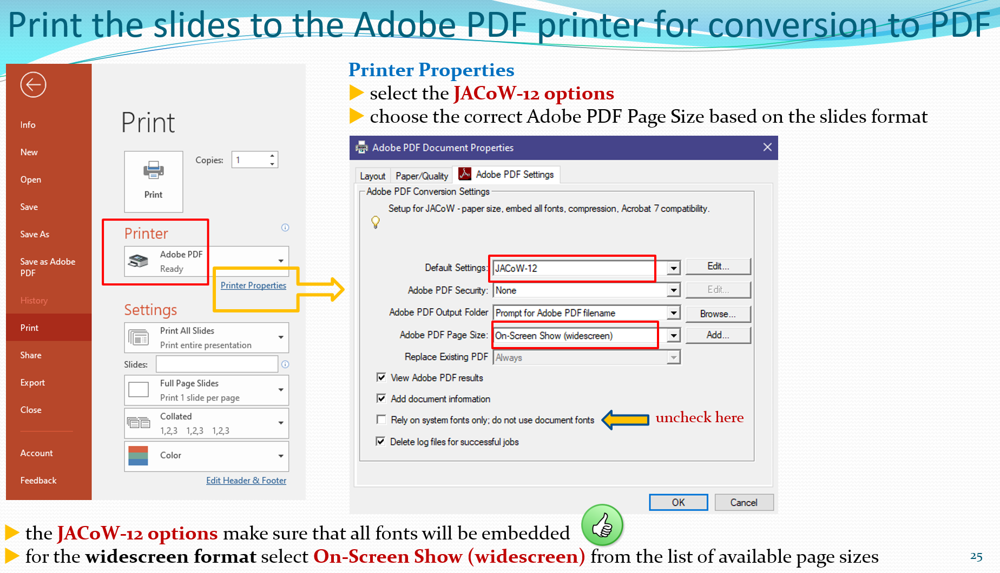
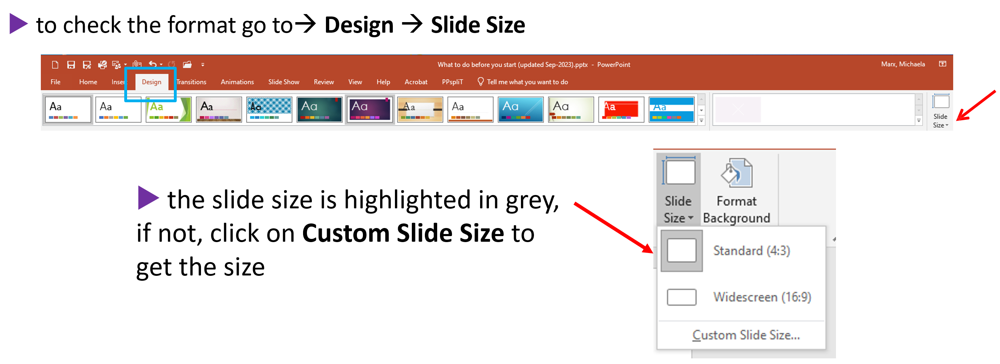
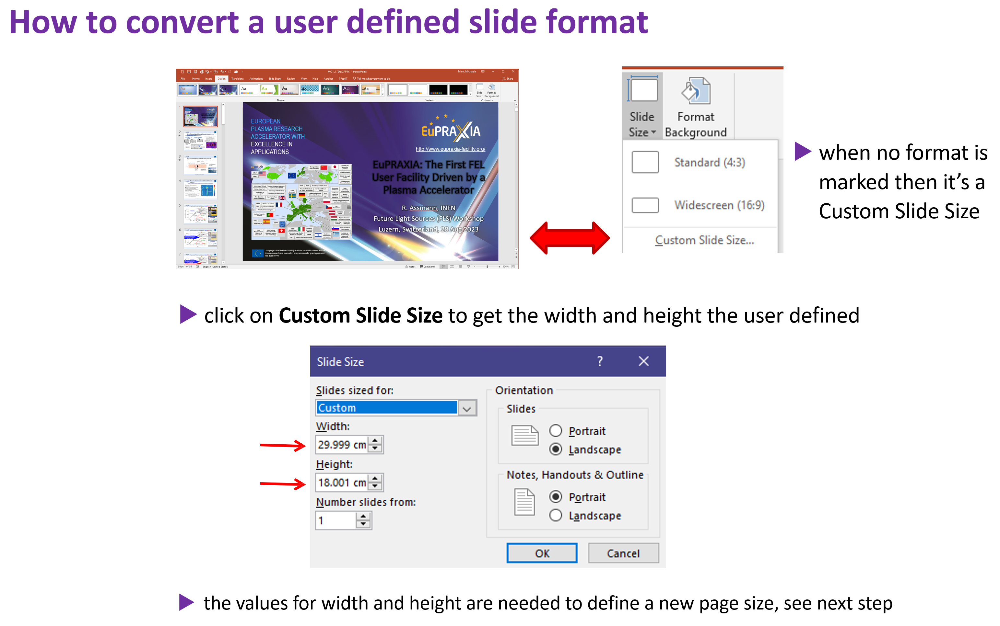

# Processing PowerPoint slides

If the author uploaded PPT (PowerPoint) slides only... download the PPT slides file, **start the slide show (press F5) for a visual inspection** and check for:

- overlapping images or text

- bad or missing characters

- animations and embedded videos

- the slides format (widescreen or 4:3)

- backup slides

In case everything looks fine, convert the PPT slides to PDF and upload them to the database.

In case you detect overlaps or animations some extra work is needed before the slides can be converted to PDF.

## How to convert PowerPoint slides to PDF?

There are different ways to convert PPT slides to PDF - but there is only one way recommended:

**<mark>print the sides to the Adobe PDF printer</mark>**

Only this way makes sure all fonts are embedded.

*Exception*: Use `Save As type PDF` when printing to Adobe PDF failed, e.g. when images look strange or colors have changed after conversion.

The following image shows the correct Printer Properties to choose for conversion to PDF:

- for Default Settings select the actual *JACoW job options* file

- for Adobe PDF Page Size choose On-Screen Show widescreen for slides in widescreen 16:9 format  or choose Slide 7.5 x 10 for slides in 4:3 format

- **uncheck** the box named "Rely on system fonts only, do not use document fonts" 

## How to fix overlapping content?

The PowerPoint Add-in named **PPsplit** is used to separate overlapping content.

The installation of the Add-in is described in the [prerequisites](2_Prerequisites.md) page.

In the following example the macro separates the overlaps and splits one slide into three:

Save the split slides as `contributioncode_TALK_split.pptx` and do not forget to upload the split file as well as the converted PDF file.

## How to adjust the slides format?

In case a speaker did not set up his PowerPoint presentation in the required widescreen format, the page size must be adapted for conversion.

 

To check the format in PowerPoint click on the Design tab and select Slide Size:

## How to deal with backup slides in PowerPoint?

Backup slides or extra/additional slides should be removed in PowerPoint before the conversion to PDF. They are not part of the official presentation and should not be published in the proceedings.

Just select the backup slides in PowerPoint and remove them from the presentation:

## What's next?

The exciting topic about [how to extract videos and animated GIFs from a PowerPoint presentation and how to embed videos in a PDF document](5_Videos_and_Animations.md) will be explained in the next section.
