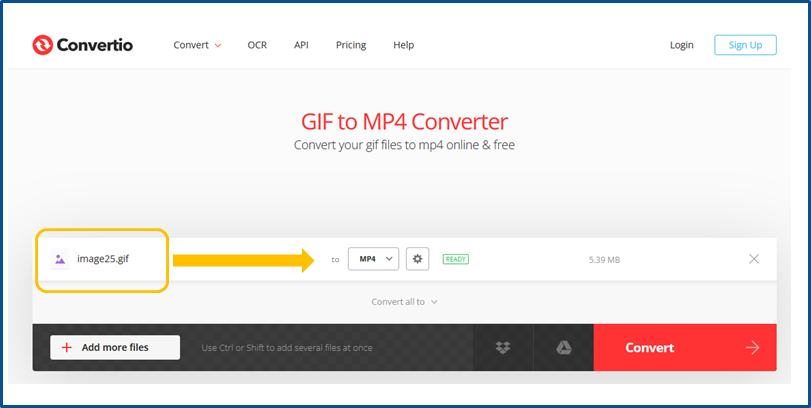
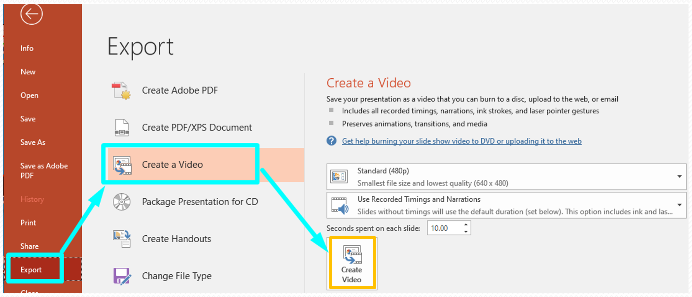
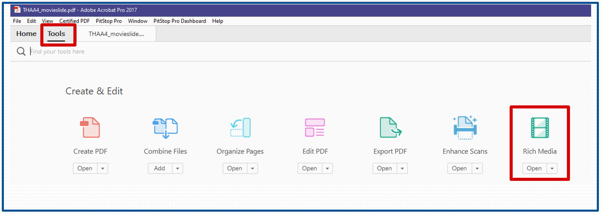
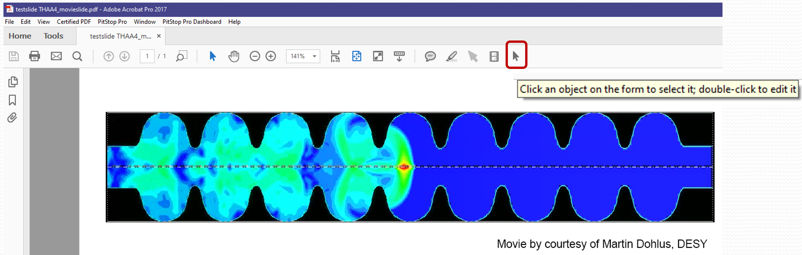

# Embedding videos and animated GIFs in PDF files

If the PowerPoint presentation contains videos or animated GIFs...

1. extract the media files

2. transform the video files to MPEG-4 (extension .mp4) which is the supported Acrobat video format

3. transform animated GIFs to MPEG-4 (extension .mp4) directly using Convertio

4. convert the PPT slides to PDF by printing to Adobe PDF

After all these mentioned steps are done, open the PDF slides file in Acrobat and embed the videos and animations.

## How to extract media files like videos and animated GIFs from PowerPoint?

In PowerPoint go to **File,** click **Save As** and choose  the .pptx format from the list of file formats.

Go to the directory where you saved the presentation and change (rename) the file extension from .pptx to .zip

Use an archive extractor tool, e.g. [7-zip](https://www.7-zip.org), Winzip or just do a right-mouse-button-click to extract the .zip file contents.

All images, videos and animated GIFs are stored in a sub-folder named **ppt/media**.

The media files we are looking for have the extension `.gif`, `.avi`, `.wmv`, and `.mp4` and must be converted to mp4 for embedding in the PDF file.

**Note**: Video files can be very large. To reduce the size of extracted mp4 files just use Handbrake and convert from mpeg-4 to mpeg-4.

## What is an animated GIF?

An [animated GIF](https://en.wikipedia.org/wiki/GIF#Animated_GIF) is a type of GIF image that can be animated by combining several images into a single file, like a flip-book.

*Credits: [Andymation](https://www.andymation.com)*

## Transforming animated GIFs to `mp4` using Convertio

Convertio converts animated GIFs (and other file formats) directly to mp4 online and for free through the web browser.

Link: [https://convertio.co/gif-mp4/](https://convertio.co/gif-mp4/)

## How to deal with motion path animations in PowerPoint?

Motion path animations are a very special visual effect in PowerPoint presentations with animated objects moving along curves or other shapes.

To embed motion path animations in a PDF document they must be recorded by starting the PowerPoint slide show. 

After the slide has been recorded, click on File/Export and select 'Create a Video':

Save as type MPEG-4 video and finally embed the movie in the PDF presentation.

## How to insert mpeg-4 (mp4) videos in PDF documents?

Videos can be embedded in PDF files with Acrobat Pro only - the simple Reader does not provide that functionality.

In Acrobat Pro click on **Tools** and select **Rich Media**:

Rich Media enables the embedding of media files.

Browse the video file which is stored on your PC.

Check the box named "Snap to content proportions" to maintain the original size of the video. 

Check the box named "Show Advanced Options" to configure the appearance and the behaviour of the video (Launch Settings and Controls).

For the launch settings choose the option **Enable when the page containing the content is visible.**

Please note: The Controls setup is disabled for actual Acrobat versions.

To modify the position or the size of the video use the **Select Object tool** from the Acrobat menu:

## Troubleshooting, Tips and Tricks

In some cases the embedded videos do not behave as expected. The following tricks can be useful to make life easier.

### Example 1: Shapes or captions are covering a video

It could happen that captions or text boxes are overlapping an embedded video in a PowerPoint presentation. They are not part of the video and will disappear after the conversion to PDF.

To fix this issue just move the text box to a position outside the video before conversion:

### Example 2: The embedded video in a PDF document appears with a fragmented black frame

After a video has been embedded in the PDF file you see black lines surrounding the video ... **this is a bug in Acrobat** where Adobe is not able or not willing to fix it.

Try to get rid of the lines by **changing the size of the video** - sometimes it works, sometimes not.

## What's next?

For more useful hints concerning the slides processing procedure get to the [**Tips and Tricks**](6_Tips_and_Tricks.md) section.
