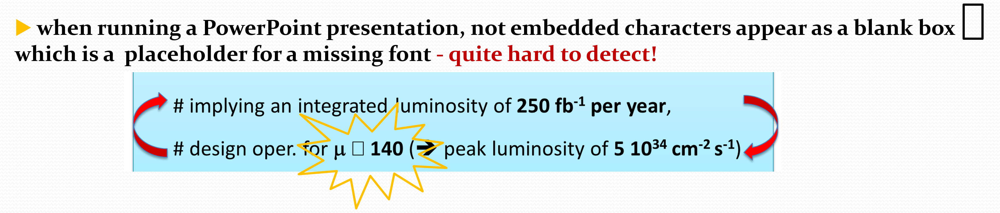

# Troubleshooting, Tips and Tricks for processing slides

The aim is to fill this page with many tips and tricks concerning the slides processing procedure. The experience you make from one conference to the next is valuable. Please report and share your knowledge with other editors.

Let's start with an issue that happens, but does not happen very often...

## Missing characters in a presentation

In this case the *Less Than or Equal* Symbol does not display correctly! This cannot be fixed by an editor. Set the processing status to RED and contact the author by writing a short notice in the comments.

## What's next?

Now that you know how to edit slides, have a look how this task fits in the whole [Slides Management workflow](7_SpeakerReadyRoom.md) of our conferences.
