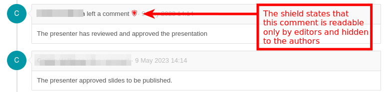
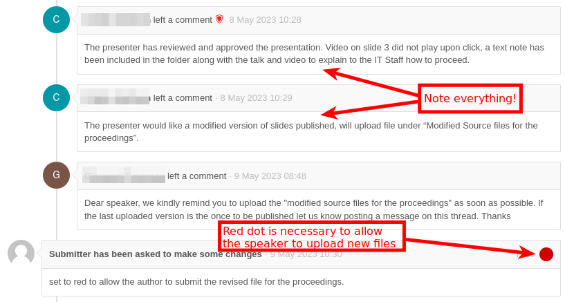

# Running the Speaker Ready Room

Speakers need to test their presentations before they scheduled time. For this reason a Speaker Ready Room is normally available at our conferences. The Presentation Managers, who would also edit slides for the proceedings, will assist the speakers with their rehearsal. Special care must be taken with the **equipment**: computers, software and other hardware (e.g., laser pointers) should be identical to those available in the auditoria. In case there are any **issues** with the presentation (e.g., wrong font rendering) the Presentation Managers will be able to help the speaker and improve the presentation material.

## Tracking speaker review and release for publication

We want to **track the activity** of the speaker in the speaker ready room, in particular two important facts:

1. whether the speaker has **successfully tested** their presentation at the venue

2. if the speaker **agrees with the publication** of the presentation in the proceedings

The easiest way is to use the comments in the Indico timeline:

As a general rule, comments about the presentation review and quality approval can stay hidden to the authors (check the option when posting the comment).

Their approval for publishing, on the other hand, is important to be public and documented. 

## More complex workflow

Sometimes the presentation does not work well on different hardware, or the author wants to publish a restricted version of their slides. In all these cases it is important to document every action or intention.

In case the author wants to provide a special version of their presentation for publication in the proceedings, the "**Special files for publication (optional)**" file type should be used.

---

**Note**: regardless of the files provided by the author, **the final PDF that is to be published must be uploaded by the slides editor as "PDF" file type**, not "Special files for publication".

---

## Criteria for publication

Only **presentations for which the author has released permission to publish** will appear in the proceedings. This means that only those slides **will be** edited, marked as "**green**" **and then QA'd OK**. All the others should be ***rejected*** by the Presentation Manager (after the presentation has been given, of course) with adequate explanation in the comments.
