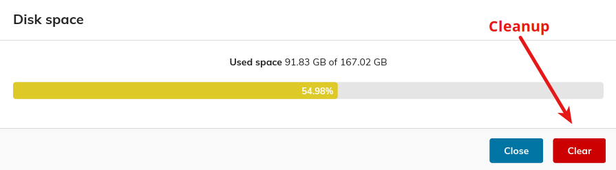

# Cleanup

The creation of the proceedings by CAT generates not only the proceedings package on the server where MEOW runs. The compressed archive to be downloaded and a lot of intermediate files are created as well.

All these files occupy a huge amount of space on the server. For this reason it is important, after the proceedings have been created and downloaded, to remove these files by way of the cleanup tool in PURR:

