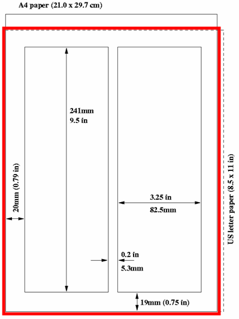

# Paper (PDF) checks

The conference editors should already have [checked all papers](/PaperEditing/Editor/edit/#judging) that will go to the proceedings and [QA'd them OK](/PaperEditing/Editor/QA.md). These are the basic necessary steps for publication.

CAT can perform two important checks on the paper PDFs of the contributions that are at the state of "Needs Confirmation' (<code style="color: gold">yellow</code>), "Accepted" (<code style="color: green">green</code>) and QA'd OK. When generating the final proceedings these tests will be performed again only on the papers that have been QA'd OK. However, the fact that this independent check can be run on all the potentially acceptable papers (a PDF in state *yellow* can easily go to QA without any other editing) allows the Editor-in-Chief to proactively spot errors during the editing stage.

The checks can be triggered by pushing the "Validate" button in PURR:

Whenever any paper is found problematic it will be listed in the PDF Check Report:

The "open" button will directly bring you to the editing timeline of that contribution.

## Page size check

The geometry of all the pages in the PDF is checked against the settings. By default, the size of the page is 595x792pt, i.e. the JACoW page made from the intersection of the sizes of A4 and US letter.

This values may be changed, if necessary, in the PURR settings:

## Fonts check

By specification, all fonts in the PDFs must be embedded (full or only as a subset).

An error will be risen If any non-Type 3 font is found not embedded on a paper, which will be reported in the screen above.

**Note**: not all Type 1 fonts can be embedded. In particular, there are [14 standard PDF fonts that cannot be embedded by definition](https://stackoverflow.com/questions/57443300/what-font-type-are-the-14-standard-pdf-fonts). If any paper uses these fonts, the fonts check will report a false positive - this (non-blocking) error should then be ignored.
